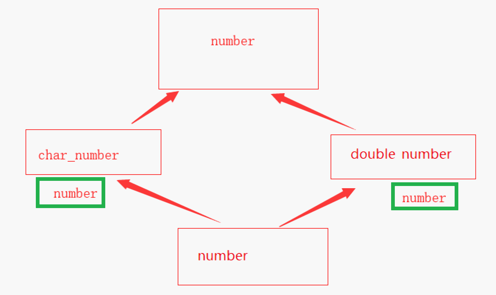
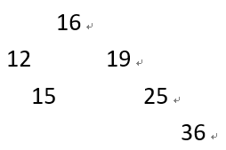
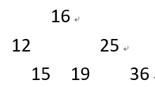

[TOC]

# 一、计算机基础部分

## 1. 原码、反码和补码

- 原码：原码的最高位保存的是它的符号位，负数的最高位为1
- 反码：反码就是将原码除符号位外按位取反
- 补码：补码就是反码+1.

## 2. 二进制、十进制和十六进制

- 二进制：0 1
- 十进制：0 1 2 3 4 5 6 7 8 9
- 十六进制：0 1 2 3 4 5 6 7 8 9 A B C D E F

## 3. 进制间的转换方式

- 不同进制到十进制的转换
  - 权位相加法
- 十进制到不同进制的转换
  - 辗转相除法，最终逆向获取余数
- 十六进制、八进制和二进制间的转换
  - 十六进制到二进制： 4个二进制 == 一个十六进制位
  - 八进制到二进制：3个二进制 == 一个八进制位
- 十进制转八进制或者十六进制，先把十转二，二再转八或十六

```
2转8
101 011 -> 53

2转16
1011 0110 -> B6

2转10
1111 -> 8 + 4 + 2 + 1 = 15
```

``` 
10进制转3进制，比如19
19 除 3 商 6 余 1
6  除 3 商 2 余 0
2  除 3 商 0 余 2
结果就是201

3 转 10 比如102
1*3^2 + 0*3^1 + 2*3^0  = 11
结果就是11
```


## 4. 数据在计算机中的存储形式

- 任何数据在计算机中都是以二进制补码方式存储的，正数三码合一


# 二、C语言部分

## 0. C语言的诞生:

- 丹尼斯里奇，1972

## 1. 变量的类型和定义:

- ####  基本数据类型(32)

  - 浮点数：float(4) double(8)
  - 整数： char(1) short(2) int(4) long(4) longlong(8)
  - 有符号类型和无符号类型:
    - 除char默认是有符号的， char的实现根据不同编译器
    - unsigned signed

- ####  变量的定义

  - 定义方式：
    - 命名规范： 由字母数字下划线组成，并且不能由数字开头，不能是关键字
    - 类型的名字 变量名;  
      - int number;
  - 关键字
    - auto int number; // 表示这是一个自动变量
    - register int number; // 寄存器变量，通常将使用很多的数据作为寄存器变量

- ####  赋值和初始化

  - 赋值：赋值就是给一个已经被定义出来的东西进行赋值

    - ```cpp
      int number;
      number = 10;
      ```

  - 初始化：在定义的时候进行赋值

    - ```cpp
      int number = 10
      ```

## 2. 常量与字面量表示:

- #### 常量的使用：

  - 定义方式

    - C语言中没有真常量

    - ```cpp
      const int number = 10;
      int arr[number] = {0};
      ```

    - #define 能定义出常量

- #### 字面量的使用：

  - 字面量的类型：
    - int: 123    0x123    010(八进制没有8)
    - char: 'C'   '\n' '\ \' '\x'十六进制字符  '\0'八进制字符
    - char*: "1234567" “abcdefg”
    - 123.456 => double (所有的浮点数常量默认都是都是double)
  - 求长度:
    - "1234\xFAGda\0123sfg\n"

## 3. 不同类型转换:

- #### 显式转换(强制转换)：

  - 显示转换就是人工的进行一个转换

  - ```cpp
    int f = (int)123.123;
    // 浮点数转整数会进行小数截断
    ```

- #### 隐式转换：

  - ```cpp
    char a = 'a';
    // a 被自动转换为 int 类型
    int b = a;
    
    // 在进行计算的时候，表达式的类型和表达式中最大类型相同
    number = 'a' + 123.0 + 456;
    
    // 函数传参的时候进行转换
    void show(int);
    show('a');
    ```

## 4. 有参宏和无参宏:

- #### 宏的使用 define
  - 有参宏：

    - ```cpp
      #define show(a) printf(a);
      // 接受字符串并输出
      ```

  - 无参宏：

    - 定义常量:  
      - #define PI 3.14
    - 定义一组有意义的数值(不需要关注具体的值):
      - #define UP 1
      - #define DWON 10

- #### 宏的缺陷：

  - 有参宏: 没有类型检查，注意优先级（内联函数）

    - ```cpp
      show(1);		// 没有类型检查的例子
      ```

    - ```cpp
      // 使用宏记得加括号 #define calc(n) (n+n)
      #define calc(n) n+n
      // int number = 4 + 4 * 5 = 24;
      int number = clac(4) * 5；
      ```

  - 定义常量的时候

    - 常量没有类型检查，C++推荐使用const
    -  定义一组有意义的数据时，数据之间没有产生联系，推荐使用枚举

## 5. 输入和输出:

- #### 格式化控制符(占位符)

  - %c %d %f %lf %u %hd %s

- #### 使用 printf 函数

  - 使用格式化输出
    - `printf("%-*.*lf", 10, 2, 1.1);`
      - `printf("%-10.2lf", 1.1);`
    - **%**-10.2**lf** => %lf  => double
    - %-**10**.2lf => 不足10个字符宽度补全，否则不变
    - %-10.**2**lf => 小数部分精度为2
    - %**-**10.2lf => 左对齐
    - 1.10XXXXXX  X 表示空格

- #### 使用 scanf 函数

  - 安全版本: 主要用于防止缓冲区溢出
  - scanf_s(): 需要在字符串的后面加上缓冲区大小

## 6. 运算符和表达式:

- #### 运算符的种类
  - ##### 算数运算符(从左到右)

    - [ + - * / % ++ --]
      - 前置++是自增再运算

  - ##### 赋值运算符(从右到左)

    - a = b = c = d = 0;
    - [ += -= *= .= %= =]
      - a += b * c + d; => a = a + (b * c + d);

  - ##### 逻辑运算符

    - && || !
      - && 短路运算符:  左边失败就不执行右边
      - ||  短路运算符:  左边成功就不执行右边

  - ##### 关系运算符

    - [ > < = >= < == !=]

  - ##### 三目运算符

    - [表达式 ? 语句一 : 语句二; ]
    - 作用if else 相同，表达式成立执行语句一、否则执行语句二

  - ##### 位运算符

    - [ | & ^ ~ >> <<]

  - ##### 逗号运算符

    - ,  逗号运算符表达式的值是最后的，但是前面的所有语句都会执行
    - (10 ,1.1, 100, "123") -> "123"

  - ##### sizeof 运算符

    - 获取类型的大小
    - sizeof 表达式
    - sizeof(类型)  推荐都加括号

- #### 运算符的优先级和结合性

- #### 表达式的种类：

  - ##### 赋值表达式: a= 10;  10

  - ##### 算数表达式: 1 + 1; 2

  - ##### 关系表达式: 1 > 2; false

  - ##### 逻辑表达式: 1 && 0: false 

  - ##### 函数表达式: func(1) 结果是返回值

## 7. 一维数组的使用:

- #### 普通数组：

  - ##### 数组的特性

    - 是用连续的空间存放一组类型相同的数据，数组的大小不可变

  - ##### 数组的初始化

    - int number[] = {1,2,3}; 大小是由初始化的数据决定的
    - int number[10];   // 没有给值，具体的值与所在位置相关
    - int number[10] = {}; // 写不写0都是0
    - int number[10] = {1,2,3,4}; // 结果是1234000000

  - ##### 数组的访问和修改

    - number[9]; 下标从0开始，越界访问可能产生问题
    - number[10] = 0; 可能会产生问题
      - 1. 可能会修改其它变量的数据
      - 2. 在堆空间中越界修改一定出错

- #### 字符串数组：

  - #### 定义: 特殊的数组，类型是char

    - char str[10] = "123456";
    - char str[] = "123456";
    - char str[10] = {”123456“};

  - #### 常见的函数

    - strcpy: 拷贝
    - strstr: 字符串找字符串 
    - strchr: 字符串找字符
    - strcmp: 字符串比较
    - strdup: 内存拷贝
    - strlen: 求字符串长度，不带空字符
    - strcat: 字符串拼接
    - sprintf: 格式化字符串
    - sscanf: 将字符串作为输入缓冲区
    - gets\puts: 获取输出一行

  - #### 字符串到数字的转换

    - atoi: 只能转十进制
    - strtol: 推荐使用，
    - StrToInt:  只能转十进制
    - sscanf: 不推荐

- 字符串和字符串数组

  - char *str = "123454678";
    - str 保存在栈区，是一个指针， "12345678"在常量区，str指向了常量区
  - char str[] = "123435678";
    - str在栈区，是一个数组，"12345678"在常量区，执行完毕，str保存的是"12345678";

## 8. 二维数组的使用:

- #### 二维数组的定义：

  - `int number[10][10] = {{1, 2}, {3, 4}, {5, 6}};`

  - 保存的内容如下

    - ```cpp
      1 2 0 0 0 0 0 0 0 0
      3 4 0 0 0 0 0 0 0 0
      5 6 0 0 0 0 0 0 0 0
      0 0 0 0 0 0 0 0 0 0
      0 0 0 0 0 0 0 0 0 0
      0 0 0 0 0 0 0 0 0 0
      0 0 0 0 0 0 0 0 0 0
      0 0 0 0 0 0 0 0 0 0
      0 0 0 0 0 0 0 0 0 0
      0 0 0 0 0 0 0 0 0 0
      ```

- #### 数组的访问

  - `numebr[0][0] = 10;`

- #### 辨别字符串数组的维度

  - {"1", "2", "3", "4"}
    - char* str[4] = { 0 };   // 存储的是字符串的地址
    - `char str[4][2];` // 二维数组，保存了所有的字符串

## 9. 指针和数组:

- #### 指针的定义

  - 指向的类型 指针的名字 = &指向的变量;
  - 如果目标是常量那么指针必须也是常量
  - 常量指针和指针常量
    - 常量指针:  是一个指针，指向了常量，指针可变，指向内容不可变
      - const int* ptr;    int const * ptr;  
    - 指针常量: 是一个常量，类型是指针，指向内容可变，指针本身不可以指向其他东西
      - int * const ptr;

- #### 指针的类型

  - 悬空指针： 指向了被释放的空间
  - 空指针： 指向了NULL的指针
  - 野指针：未初始化的指针

- #### 指针的算术运算

  -  +: 指针+1，加的是 sizoef(指针类型)
  -  -：指针-1，数组中计算的是它们之间的元素个数，指针减法一般没有意义。

- #### 数组指针和指针数组

  - 数组指针: 一个指针，指向了数组

    - ```cpp
      int arr[10] = { 0 };
      // 指针的名字就是数组首元素的地址
      // arr -> &arr[0], 指针的类型应该是数组首元素的类型
      int * ptr = arr;
      
      int arr[10][10];
      // 指针的名字就是数组首元素的地址 
      // arr -> &arr[0], arr[0] 是一个一维数组
      int (*ptr)[10] = arr;
      
      // int*      ptr[10] = arr;
      ```

  - 指针数组: 一个数组，保存了指针

    - ```cpp
      char* arr[10];       // 一个数组，保存的是字符串的首地址
      const int* arr[10];  // 一个数组，保存的是const int类型数据的地址
      ```

- #### 函数指针

  - void show(int);  // 函数原型
    - void (*)(int);

## 10. 堆的使用:

- ##### 堆的申请函数：

  - malloc: 直接申请空间，没有初始化
  - realloc: 重新申请空间，把原空间的数据拷贝到新的空间 
  - calloc : 申请空间并初始化

- ##### 堆的释放函数：

  - free() 如果不释放会导致内存泄漏

- ##### 内存操作函数：

  - memcpy: 内存拷贝，按字节 
  - memset: 赋值
  - memcmp: 内存比较

## 11. 程序的三大结构:

- #### 顺序结构

  - #### 特点：自上而下

- #### 选择结构

  - #### 特点：多个分支只会执行一个

  - #### 分支的种类

    - if ... else if .... else

      - 通常用于指定的范围的判定
      - 如果if不成立就执行elseif，如果都不成立就执行else

    - switch.. case:

      - 通常用于指定值的判定

      - case: default: 

        - case成立就执行case，否则执行default
        - 分支的执行和位置没有任何关系

      - break; 如果在case中没有编写break，那么会顺序往下执行，

        ​	直到switch块结束或者遇到break

- #### 循环结构

  - #### 特点：根据条件循环一定次数

  - #### 循环的种类：

    - 入口条件循环：在进入循环的时候首先进行判断
      - for：for(语句1; 语句2; 语句3) { 代码块4 }
        - 语句1: 通常用于初始化，只会执行1次
        - 语句2：循环条件，没执行一次循环体，就要判断一次，判断次数比循环次数+1
        - 语句3：通常用于自增，执行次数和循环次数相同
        - 执行顺序: 1 2 4 3 2 4 3 2 4 3 2....
      - while
        - while(表达式) {代码块}
    - 出口条件循环: 先执行语句块再进行判断
      - do while
        - do { 代码块}while(条件)
        - 先执行代码，在判断条件

  - #### break和continue

    - break: 可以用于 switch 和循环内，用于直接结束当前最内层的循环
    - continue: 只能用于循环内，用于跳过当前最内层循环的剩下部分，进入下次循环

  - #### 循环的嵌套

    - ```cpp
      for (int i = 0; i < 10; ++i)
      {
          for (int j = i; j < 10; ++j)
          {
              printf("*");
          }
          printf("\n");
      }
      // 杨辉三角
      // 菱形
      // 九九乘法表
      // 水仙花
      ```

  - #### 死循环的形成条件

    - for(;;): 如果中间的表达式不填写数据，就是死循环
    - while(1): 表达式永远为真，只能通过break(goto return)之类的跳转语句结束

  - #### while 与 for 的转换

    - ```cpp
      for (int i = 0; i < 3; ++i)
      {
          printf("%d ", i);
      }
      ```

    - ```cpp
      int i = 0;
      while (i < 3)
      {
          printf("%d ", i);
      	++i;
      }
      ```

## 12. 使用枚举:

- ##### 枚举的定义

  - enum DIR { UP, DOWN, LEFT, RIGHT};
  - 如果不指定起始的值，值从0开始
  - 下一个值是根据当前的值决定的，比如当前是LEFT =2,RIGHT 就是3

## 13. 使用结构体:

- ##### typedef 关键字

  - typedef用于定义别名，通常和结构体一起使用

    - 由于C语言的规定，不支持直接使用结构体的名字进行变量的定义

      所以，使用typedef 关键字取别名可以简化类型的定义

- ##### 结构体的定义

  - ```cpp
    // 结构体通常用于存储有关联但是类型不同的一组数据
    struct _TEST{
    	int a;
    	char b;
    };
    
    // 定义了一个结构体并直接产生了一个变量
    struct _TEST {
    	int a;
    	char b;
    }abc = {1, 'a'};
    
    // 定义了结构体并且取别名,
    typedef struct _TEST {
    	int a;
    	char b;
    }TEST, *PTEST;
    
    // 加了 typedef 就是别名，没加就是变量
    
    TEST test; // 没有初始化
    TEST test = { 0 }; // 全都初始化为0
    TEST test = { 1 }; // 除第一个全都初始化为0
    ```

- ##### 访问和修改

  - 使用指针: `PTEST pTest = &test; pTest->a = 10;`
  - 使用结构体本身:`Test.a = 10;`

- ##### 大小计算

  1. 结构体的总大小是结构体内最大类型的倍数
     - 例如最大的是double,那么结构体大小肯定是8的倍数
  2. 结构体的成员所在的偏移和成员本身的类型相关
     - 成员类型为 float, 那么它所在的便宜必须  sizoef(float) 4的倍数

  - ```cpp
    struct _TEST{
    	char a;		
    	int b;
    	char c;
    	double d;
    	char e;
    };
    
    sizeof(_TEST) == 32;
    // a X X X b b b b 
    // c X X X X X X X 
    // d d d d d d d d
    // e X X X X X X X
    ```


## 14. 使用联合体:

- ##### 联合体的定义:

  - union u {int n; doube d; char c};

- ##### 访问和修改

  - 同一时刻，谁都能访问，但是只有一个数据是有意义的

- ##### 大小的计算

  - 联合体的大小由最大的类型决定，所以u的大小是8

## 15. 函数的定义和使用:

- #### 函数的定义

  - 函数的定义由三个部分组成
    1. 返回值: 就是函数调用表达式的结果，返回值必须和返回值的类型相同
    2. 函数名: 标识当前的函数，命名规则和变量相同
    3. 形参列表: 当前函数接收的参数个数和类型
  - 声明和定义
    - 声明: void func(int)**;** 声明一个函数没有返回值并且接受一个int参数
      - 声明必须要在使用前，然后函数可以没有声明
      - 当函数的定义位置在调用之前就不需要声明了
      - 声明通常写于头文件，实现 通常位于CPP
    - 定义(实现): 通常是函数原型后加上花括号编写函数体

- #### 形参和实参

  - 形参：形式参数，函数内的局部变量，**是实参的拷贝**

    - 直接修改形参，实参不会改变，可以使用指针间接改变

  - 实参：实际参数，传入的具体的值

  - ```cpp
    void show(int n)
    {
        // 这里的n是一个形参
        print("%d\n", n);
    }
    
    // 实参的名字和形参没有关系
    int number = 10;
    // number 就是一个实参
    show(number);
    
    // 传参结束后，函数内实际
    void show(int n)
    {
        // 将形参赋值为实参
        // n = number(10);
        // 这里的n是一个形参
        print("%d\n", n);
    }
    ```

- #### 不同类型的参数传递

  - 数组的传参
    - int arr[] => void show(int *) => void show(int []) 
    - `int arr[10][10]  `
      -  `void show(int (*a)[10], int size)`
      -  `void show(int [][10], int size) `
  - 基本类型的传参
    - void show(想要传入的类型)
  - 结构体的传参
    - void show(结构体的名称 变量名)
    - 不推荐使用结构体的值传递，*占位置*，**其次不好逆向**
  - 函数的传参
    - 考验的就是函数指针，通常用于windows编程和STL编程

- #### C语言函数的传参方式

  - 值传递： 不能够修改实参的值
  - 指针传递: 可以间接修改实参的值

- #### 函数的递归

  - 函数之间的互相调用就是函数递归
  - 递归必须有结束条件，否则会导致栈溢出
  - 能使用循环解决的问题，尽量不要用递归

- #### 内联函数

  - inline: 在函数前使用inline定义内联函数
  - 优点: 不会产生堆栈，加快执行速度
  - 缺点: 如果内联函数内的代码过多，会导致所在函数的代码膨胀

## 16. 预处理指令:

- ##### 文件包含

  - #include 实际上进行的是赋值粘贴的操作
  - 有两种方式可以防止头文件的重复包含
    - #pragma(once)
    - #ifdef XXX \ #define XXX \ #endif

- ##### 宏定义

  - #define 用于定义常量，有参宏或一组有意义的名字

- ##### 条件编译

  - #if #else #endif # ifdef #ifndef
  - 通常用于根据不同的环境生成代码

- ##### 特殊的宏

  - `__LINE__`
  - `__FUNC__`

## 17. 文件操作

- ##### 打开和关闭

  - 打开: fopen / fopen_s: 
    - r+/w+ 可读可写打开
    - r 只读，存在是才打开
    - w 只写，不存在就创建
    - b: 二进制打开，取别在于换行 \n  \r\n
    -  是否是二进制读取和打开方式没有关系
      - fread\fwrite
  - fclose打开

- ##### 操作文件内容

  - fprintf/fscanf
  - fput/fgets
  - fgetc/fputc
  - fread/fwrite 
    - fread(读到哪里，都多少个数据块，每个数据块多大，从哪个文件读)

- ##### 绝对路径和相对路径

  - 绝对路径: 从根目录开始进行查找: 通常是磁盘
  - 相对路径: 相对于当前的工作路径进行的寻址 
    - . 代表当前目录
    - .. 代表上层目录

## 18. 生存周期和作用域:

- #### 局部变量(栈)

  - 在花括号内定义的就是局部变量
  - 生存周期
    - 进入花括号创建，离开或括号销毁
  - 作用域:
    - 从定义开始到花括号结束。

- #### 全局变量(静态数据区)

  - 在所有花括号外面定义的就是全局变量
  - 作用域
    - 从定义开始到文件的结尾
    - 可以使用 extern 放其它文件中的全局变量
    - **注意**： 全局变量的定义应该放在cpp中，头文件应该使用extern
  - 生存周期：
    - 全局变量的初始化位于main函数之前
    - 程序的开始到程序的结束

- #### 静态变量(静态数据区)

  - 使用static定义的变量就是静态变量

  - 生存周期：

    - 生存周期是定义开始到程序结束
    - **静态变量追只会被初始化一次**

  - 作用域：

    - 和定义的位置相关

    - **static变量不跨文件，不能在其它文件中访问**

- #### 堆变量(堆空间)

  - 堆空间的数据由编写者控制

  - 使用malloc和free系列的函数可以申请和销毁堆空间

  - 生存周期

    - malloc 开始 free 结束

  - 作用域：

    - 和定义的位置相关

  - ##### 注意

    1. 不释放堆空间的数据会导致内存泄漏
    2. **如果破坏了堆标记，会影响到整个程序内的堆空间**

## 19. 其它标准函数

- clock(time): 获取当前的时间

- rand/srand: (rand\stdlib)

  - srand通常在初始化的时候调用一次， srand((unsigned int) time(0));

  - ```cpp
    // 使用当前时间初始化随机数种子
    srand((unsigned int)time(0));
    
    for (int i = 0; i < 10; ++i)
    {
        // 使用当前时间初始化随机数种子
        // srand((unsigned int)time(0));
    
        // 输出生成的随机数
        printf("%d ", rand());
    }
    ```

- _getch/ _kbhit(conio.h)

  - _getch(): 无回显输入

  - _kbhit(): 检查键盘击键，不会接受缓冲区内的输入

  - ```cpp
    if (_kbhit())
        charch = _getch();
    ```

- ctype.h

  - islower: 判断是不是小写
  - tolower: 将字母转换为小写
  - isalpha: 判断是不是字母
  - isdigit: 判断是不是数

# 三、C++部分

## 0. C++的诞生

- Bjarne Stroustrup 1983

## 1. C++的特性

- const 的新用法
  - C++的const是真的常量，可以用于设置数组的长度
  - const常见的用法
    1. 定义常量: const int PI = 3.14;
    2. 用作修饰函数的参数，确保不被修改，参考strstr
    3. 函数返回一个常量。
    4. 修饰当前对象的内容不能被修改。int get() const;

- 引用类型
  - 引用类型的定义: 类型 & 引用名称 = 被引用对象;
  - 引用和指针的关系
    - 引用必须初始化，非常量指针不用初始化。
    - 引用一经初始化，不能指向其它变量。非常量指针可以。
    - 使用引用可以直接访问被引用对象，指针需要通过(*)间接的访问。
    - 在实现上，引用和指针完全相同，推荐使用引用。

- 函数的重载

  - 函数重载的目的：静态联编多态

    - 通过一个函数名称可以传入不同的参数调用不同的函数

  - 函数重载的要求

    - int show(int);

    1. 函数的名称及作用域相同
    2. 函数的参数个数不同
       - int show(int, double);
    3. 函数的参数类型不同
       - int show(double);
    4. 函数的参数顺序不同
       - int show(double, int);
    5. 函数的返回值不是函数重载的要求之一
       - **void show(int);   不可以**

- 函数的默认参数

  - 声明函数的默认参数
    1. 当只存在函数定义的时候，直接写在函数定义中
    2. 当同时存在定义和声明的时候，只能写在其中的一个中，推荐写在声明中。
  - 使用默认参数的要求
    1. 默认参数的顺序必须是从右到左不能断开

- C++中堆的使用(new/delete)

  - 申请堆空间: new / new[]
  - 释放堆空间 delete / delete[]
  - C语言和C++中使用堆的区别

    1. new/delete会调用构造和析构，但是malloc/free 不会调用
    2. new 的单位是元素个数`new int[15];`，malloc的单位是字节`malloc(sizeof(int) * 15)`
    3. new 的返回值是类型的指针，但是malloc的返回值是void*
    4. new/delete是运算符(关键字)，malloc和free是库函数

    - **new/delete的底层实现通常都是 malloc/free**

- C++中的类型转换
  - static_cast：静态类型转换
  - const_cast: 常量转换
  - reinterpret_cast : 通常用于指针间的转换
  - dynamic_cast：用于父类指针和子类指针之间的转换

## 2. 输入和输出

- 使用输入函数 iostream
  - std::cin **>>** 变量1 **>>** 变量2; 
  - (std::cin.operator>>(变量1)).operator>>(变量2);
- 使用输出函数 iostream
  - std::cout **<<** 变量1 **<<** 变量2 << std::endl << std::endl;
- 格式化输出数据 iomanip
  - setfill: 设置填充数据
  - setw: 设置宽度
  - hex: 十六进制显示
  - **推荐使用printf格式化输出**

## 3. 类的定义与使用

- 面向对象的三大特性:

  - 封装、继承、多态

- 三大权限：

  - public: 公有的，可以直接在外部访问
  - protected: 保护的，可以被继承，但是不能在外部访问
  - private: 不能被继承，且不能再外部访问

- 成员函数和数据：

  - 数据的定义
    - 在类内定义的数据都是数据成员，作用域是当前类
  - 成员函数的定义
    1. 在类内编写声明和实现
    2. 在类内声明，在类外实现(类外实现必须加上**类域**)
    3. **在单独的头文件中声明，并且在单独的cpp中实现**

- 静态函数和数据：
  - 静态数据：

    - 静态数据的定义: 在类内数据的定义前使用static关键字进行**声明**

      必须要在类外进行初始化，否则报错: 无法解析的外部符号

  - 静态函数：

    - 静态函数的定义就是在函数前使用static，静态函数**没有this指针**，并且**不能访问非静态函数以及非静态成员** ， 通常使用静态函数访问静态成员。

  - 访问静态数据的方法:

    - 直接用对象访问 `TEST test; test.static_int;`
    - 直接用类名访问(推荐)`TEST::static_int`

- 使用初始化列表：

  - 初始化列表用于对类内的数据进行初始化，只能写在构造函数中
    1.  引用必须在初始化列表内初始化
    2.  常量必须在初始化列表内初始化
    3.  没有无参构造的成员对象必须在初始化列表内初始化
    4.  没有无参构造的父类引用必须在初始化列表内初始化

- 结构体和类的区别

  - class默认的继承方式是private，struct默认继承方式是public
  - class默认的访问属性是private，struct默认访问属性是public

## 4. 构造和析构

- 默认构造(析构\拷贝构造)函数（赋值运算符，取地址符）
  - 默认的构造函数没有参数，没有实现任何内容
    - TEST() = defult;  // delete
  - 默认的析构也没有任何的实现。
    - ~TEST() = defult;

- 无参构造函数
  - 特点: 没有参数，通常用于进行默认初始化
    - `vector<int> vec; => vector<int>(); `

- 有参构造函数(构造函数可以重载，可以设置默认值)
  - 特点：需要传入的参数个数大于1，
    - `vector<int> vec(10); => vector<int>(int);`
    - `vector<int> vec(10, 1); => vector<int>(int, int);`

- 转换构造函数
  - 特点：需要传入一个参数的构造就是转换构造
  - 用途：将其他类型的值转换成当前类型，基本不用
    - explicit关键字: 禁止隐式的调用转换构造函数

    - ```cpp
      void show(OBJ obj);
      // 如果没有 explicit
      show(1);
      // 写了 explicit
      show(OBJ(1));
      ```

- 拷贝构造函数

  - 特点: 只有一个参数，是当前类对象的引用

  - 使用当前类对象的引用是为了防止递归调用。

    - `OBJ(OBJ & obj);`
    - `OBJ(const OBJ & obj);`

  - 拷贝构造的调用时机

    - 使用同类型的对象进行初始化的时候

      - ```cpp
        OBJ obj;		// 无参构造
        OBJ obj1(obj);	// 拷贝构造
        OBJ obj2 = obj;	// 拷贝构造
        OBJ obj3 = new OBJ(obj);	// 拷贝构造
        ```

    - 将对象作为**值**传递的时候

      - ```cpp
        void show(OBJ obj);
        show(obj);	// 调用了拷贝构造
        ```

    - 将对象作为**值** 返回的时候

      - ```cpp
        OBJ show(OBJ obj)
        {
            return obj;
        }
        // 调用了两次拷贝构造
        // 1. 传参的时候
        // 2. 在函数内进行返回的时候
        OBJ retObj = show(obj);
        ```

  - 深拷贝和浅拷贝

    - 浅拷贝: 默认生成的构造函数是浅拷贝，浅拷贝就是指针的值拷贝
    - 深拷贝: 深拷贝就是指针的内存拷贝
      - 可能会用到的函数(深拷贝必须涉及到内存的拷贝):
        - memcpy
        - strcpy
        - _strdup

- 析构函数
  - 特点： 析构函数只能有一个，没有返回值，没有参数，名字是~类名();
  - 用途： 对象销毁的时候自动调用一次，通常用于清理内存关闭句柄或文件。

## 5. 友元特性

- 友元： friend
  - 破坏封装性，为了访问其它类中的私有数据。
  - 友元的声明应该写在类内，也就是主人家里，主人要求客人。
- 友元类
  - 友元类的声明同样写在主人类里面
    - friend class XXX;  
      - 缩写自: class XXX;  friend XXX;
- 友元函数
  - 友元函数是不是成员函数？不是
  - 使用友元函数可以访问到类内的所有私有数据
    - friend void show(TEST &test);

## 6. 单继承和多继承

- 继承方式
  - public: 公有继承下，除了私有属性，其余在子类中保持不变
  - protected: 保护继承下，除了私有属性，其余全都变成保护的
  - private:私有继承下，除了私有属性，全都变成私有的

- 单继承中的重定义
  - 单继成的语法: class 当前类 : 继承方式 **父类** { }; 

  - 当子类中的变量或函数名和父类中的重复，那么子类中的变量或函数会**隐藏**父类中的数据

    - ```cpp
      class Base
      {
      public: 
      	// 数据成员相同
      	int number;
      	// 函数名和参数相同
      	void show() { printf("Base::show()\n"); }
      	// 函数名相同参数不同
      	void show2(int n) { printf("Base::show(int n)\n"); }
      };
      
      class Child : public Base
      {
      public: 
      	// 数据名称完全相同
      	int number;
      	// 函数名和参数相同
      	void show() { printf("Child::show()\n"); }
      	// 函数名相同参数不同
      	void show2(double n) { printf("Child::show(int n)\n"); }
      };
      ```

    - 想要访问父类中的同名数据，需要使用作用域 

      - child.Base::number;    **加载数据的前面**

- 多继承中的二义性

  - 多继承的语法: class 当前类名: 访问属性 父类1, 访问属性 父类2 .... { };

  - 当多个父类中有同名的数据，在子类中访问时，会导致调用不明确

    - ```cpp
      class Base1
      {
      public: int number = 10;
      };
      
      class Base2
      {
      public: int number = 20;
      };
      
      class Child : public Base1, public Base2
      {
      };
      
      int main() 
      {
      	Child c;
      	c.Base1::number;	//10
          c.Base2::number;	//20
      	return 0;
      }
      ```

    - 解决方法是在使用时，添加父类的作用域.

  - 缺点：同样的数据在内存中保存有两份，同样的数据越多，浪费的内存越大。

- 菱形继承中的二义性

  - 将多继承中的公有数据放入到新创建的爷爷类中，继续继承会产生菱形继承。
  - 
  - 解决方法： 
    1. 不要写出这样的代码
    2. 使用作用域进行访问
    3. 采用虚继承的方式

- 使用虚继承

  - 用于解决**菱形继承**中产生的二义性问题。

  - ```cpp
    class Yeye
    {
        public: int number = 10;
    }
    
    // 父亲1类虚继承自爷爷类
    class Base1	: public virtual Yeye
    {	// 关键字 virtual 放置的位置可以在 public 的前后
    };
    
    // 父亲2类虚继承自爷爷类
    class Base2	: virtual public Yeye
    {
    };
    
    // 子类的继承不做修改
    class Child : public Base1, public Base2
    {
    };
    
    int main() 
    {
    	Child c;
    	c.number;	
        // 虚继承后，爷爷只有一份，访问到的就是爷爷类中的number
    	return 0;
    }
    ```

- 虚基表和虚基表指针

  - 当存在虚继承时，有多少个父类进行了虚继承，就会产生多少个虚基表指针

  - 虚基表指针指向的是对应的虚基表，虚基表中保存的是距离爷爷类的偏移。

  - ```cpp
    class Yeye
    {
    public: int number = 0x66666666;
    };
    
    // 父亲1类虚继承自爷爷类
    class Base1 : public virtual Yeye
    {	// 关键字 virtual 放置的位置可以在 public 的前后
    	int numberA = 0x11111111;
    };
    
    // 父亲2类虚继承自爷爷类
    class Base2 : virtual public Yeye
    {
    	int numberB = 0x22222222;
    };
    
    // 子类的继承不做修改
    class Child : public Base1, public Base2
    {
    	int numberC = 0x33333333;
    };
    
    int main()
    {
    	Child c;
    	c.number;
    	// 虚继承后，爷爷只有一份，访问到的就是爷爷类中的number
    	return 0;
    }
    
    0x001DFE3C  00b37b48  H{ ? .
    	0x00B37B48  00000000  ....
    	// 保存的是Base1到爷爷类的偏移
    	0x00B37B4C  00000014  ....
    0x001DFE40  11111111  ....
    0x001DFE44  00b37b54  T{ ? .
    	0x00B37B54  00000000  ....
    	// 保存的是Base2到爷爷类的偏移
    	0x00B37B58  0000000c  ....
    0x001DFE48  22222222  """"
    0x001DFE4C  33333333  3333
    0x001DFE50  66666666  ffff
    ```

## 7. 多态和虚函数

- C++中的多态
  - 函数重载(静态联编)
  - 函数重定义(静态联编)
  - 模板(静态联编)
  - 虚函数(动态联编)
- 动态联编和静态联编
  - 动态联编：在程序运行的时候确定调用的是哪一个函数
    - 使用动态联编的要求
      1. 必须存在虚函数
      2. 使用父类指针或子类指针或**引用**
      3. 调用了虚函数
  - 静态联编：在程序编译时就确定了调用的是哪一个函数
- 虚函数的定义
  - 在普通成员函数的前面加上 virtual 关键字
  - 实现起来和普通的函数是一样的
  - **使用父类指针指向不同子类，调用的是对应的虚函数**
  - 子类重写父类的虚函数时，可以不添加 virtual 关键字，虚函数是向下继承的，也就是说子类中额外添加的的虚函数在父类中不存在
- 虚函数表和虚表指针
  - 当一个类中拥有虚函数时，就会存在虚函数指针
  - 虚函数指针的数量由存在虚函数的父类决定
    - 假设继承三个类，其中两个类有虚函数，那么有两个虚表指针
  - 关于虚函数表
    - **每个类都有对应的虚函数表，相同的类对象，使用的是同一张虚函数表**
      - 虚函数表在构造函数内被初始化
    - 虚函数表内存储的是什么？
      1. 父类的虚函数(纯虚函数)
      2. 子类重写的虚函数
      3. 子类多写的虚函数(子类中多添加的虚函数被添加在第一张虚函数表内)
- 虚析构函数的使用
  - 为什么有虚析构函数？
    - 答： 如果不存在虚析构函数，那么当父类指针指向子类对象的时候，释放父类指针，只会调用父类的析构函数，可能导致子类对象的内存泄漏等问题。
    - **虚析构函数的目的是为了防止子类对象的析构函数不被调用。 **
- 纯虚函数和抽象类
  - 抽象类： 有纯虚函数的类就是抽象类
    - 抽象类不能被实例化，如果一个类继承自抽象类，没有实现它的**所有**纯虚函数，那么它仍然是一个抽象类。
  - 纯虚函数：用于定义一个必须要子类实现的函数
    - 语法: **虚**函数 = 0;

## 8. 运算符重载

- 不能被重载的运算符
  - :: 、:? 、. 、sizeof
- 只能被重载为非静态成员函数的运算符
  - =,[ ],(),->
- 使用成员函数重载和使用友元函数重载
  - 成员函数重载运算符，参数最少为0个
  - 友元函数重载运算符，参数最少为1个
- 需要特殊对待的运算符
  - 自增自减: int operator++(int); 后置++ ，括号内有int 的是后置++
  - 流运算符: << >>， 通常被重载为友元函数
    - 返回值和参数是引用类型，原因是 istream/ostream的拷贝构造被删除了

## 9. 函数模板和类模板

- 模板的使用：模板用于实现类型不同但是逻辑相同的类和函数
  - **template** [class | typename]
    - class 和 typename 没有区别

- 函数模板的使用

  - 函数的寻找优先级: 普通函数 > 模板函数 > 特化函数
  - 函数模板和模板函数:
    - 函数模板：是一个模板，**不会生成具体的代码**，只提供逻辑
    - 模板函数：当一个函数模板被使用的时候，会检查参数，并根据传入的参数实例化出一个模板函数，**模板函数会生成实际的代码**；
  - 函数模板有全特化，但是没有偏特化，函数模板的偏特化就是函数的重载。

- 类模板的使用

  - 类模板可以全特化也可以偏特化

    1. 全特化就是特化所有的类型
    2. 偏特化就是特化部分的类型

    - **类模板的实现和定义必须要放在同一个文件，否则会报错**

    - 当在类模板外实现函数时，需要重新的指定模板关键字和参数

      - ```cpp
        template <class T>
        class Test
        {
        public: 
        	T number;
        	T operator-();
        };
        
        template <class T>
        // 需要加上T表示当前是一个模板
        T Test<T>::operator-()
        {
        	return -number;
        }
        
        int main()
        {
            // 使用模板类需要指定类的类型
            Test<int> test;
            
            return 0;
        }
        ```

    - **不管是函数模板还是类模板的特化都必须写在模板的下面**

## 10. 重载重写和重定义

- 重载
  - 作用域相同，参数不同，名称相同。
- 重写 override
  - 作用域不同，必须存在虚函数，参数和返回值需要一致。
- 重定义
  - 作用域不同， 参数可以相同也可以不同，子类的同名函数会隐藏父类的函数。

## 11. 命名空间的使用

- 命名空间的作用
  - 命名空间用于解决变量名冲突的问题
- 访问命名空间中的数据
  1. 添加作用域: std::cout
  2. 使用 using namespace std; cout
     - 缺点是，可能会造成名称的冲突
  3. 推荐使用: using std::cout: 
     - 缺点是太长了

## 12. STL库的使用

- vector: 动态数组
  - push_back
  - pop_back
  - at
  - erase
  - insert
- list: 双向循环链表
  - 它没有重载[]运算符，原因是链表不能动态存取
- map: 红黑树(二叉树)
- string: 字符串
  - +: 拼接字符串，没有 改变原有的值
  - +=: strcat，拼接字符串
  - =: strcpy 拷贝字符串
  - .length(): strlen() 获取字符串的长度
  - append: 追加字符串

## 12.  异常处理

- try： 包含的是可能产生异常的代码 ，用于捕获异常
- throw : 用于主动的抛出异常
- except: 用于获取对应类型的异常，可以有多个except，如果最后一个except内参数是...表示捕获所有类型的异常

# 四、数据结构部分

## 0. 数据结构基础

- 算法的特性

  - 有穷性：算法不会产生死循环。
  - 可行性：算法是可以实施的。
  - 输入输出：可以没有输入，但是必须要有输出
  - 确定性：输入同样的数据，返回的结果是相同的
- 算法的度量
  - 事前估算：大O记法
  - 事后统计：成本大，**不用**
- 物理结构和逻辑结构
  - 物理结构
    - 顺序结果
    - 链式结构
  - 逻辑结构
    1. 集合(相互之间没有关联)
    2. 线性(一对一)
    3. 树形(一对多)
    4. 图(多对多)

## 1. 线性表(一对一)

- 顺序表
  - 增删: O(n)
  - 访问: O(1)
  - 当数据访问较多，增删较少的时候，使用顺序表
- 链表
  - 增删: O(1)

    - 添加节点

      - ```cpp
        prenode -> nextnode
           \ newnode /
        
        // 先让新的节点指向下一个节点，再让上一个节点指向新的节点
        newnode->next = pre->next(nextnode);
        pre->next = newnode;
        ```

    - 删除节点

      - ```cpp
        prenode -> delnode -> nextnode
        
        // 将要删除的前一个节点指向要删除的下一个节点，然后再释放要删除的节点
        prenode->next = delnode->next(nextnode);
        delete delnode;
        ```

      - 

  - 访问:O(n)

  - 当数据的访问较少，增删较多时，使用链表
- 栈

  - 特性： 先进后出
- 队列

  - 特性：先进先出

## 2. 树和二叉树(一对多)

- **二叉排序树**的性质

  - 左边的节点小于根节点，右边的节点大于根节点
  - 每个节点最多只有两个子节点

  

- 节点的计算

  - 满二叉树： 最底层的节点填满的树
    - 求节点的个数  2^n^-1
  - 完全能二叉树：除了最底层，所有的节点多不是叶子节点
    - 求最少的节点个数 2^(n-1)^+1-1 -> 2^(n-1)^

- 节点的添加

  - 边的节点小于根节点，右边的节点大于根节点
  - **在某一棵树中添加一个节点，需要比较多少次**

- 节点的删除

  - **在某一棵树中删除一个节点，需要寻找多少次**

- 节点的遍历

  - 前序遍历：根 - 左 - 右 => 16 12 15 25 19 36

    - ```cpp
      void 前序遍历(NOde node)
      {
          if (node != nullptr)
          {
              输出内容;
              前序遍历(左子树);
              前序遍历(右子树);
          }
      }
      ```

  - 中序遍历：左 - 根 - 右 => 12 15 16 19 25 36

    - ```cpp
      void 中序遍历(NOde node)
      {
          if (node != nullptr)
          {
              中序遍历(左子树);
              输出内容;
              中序遍历(右子树);
          }
      }
      ```

  - 后序遍历：左 - 右 - 根 => 15 12 19 36 25 16

    - ```CPP
      void 后序遍历(NOde node)
      {
          if (node != nullptr)
          {
              后序遍历(左子树);
              后序遍历(右子树);
              输出内容;
          }
      }
      ```

  - 层序遍历：16 12 25 15 19 36

- 平衡二叉树的性质

  - 左子树和右子树的高度小于2

  

## 3. A* 算法
- A* 算法是什么？
  - A* 算法是一个寻路算法

# 五、Python部分

## 1. 基础知识

- Python中变量的特点
  - Python是一个解释型的动态语言。
    - 解释型： 它是运行在 PVM 中，指令是逐条翻译执行的
    - 动态语言： 变量类型是在运行中确定的，并且变量类型可以改变
  - Python中的变量可以看作是一个 void* 指针，指向了实际的数据
- 基本变量类型
  - float: 浮点数
  - int: 整数
  - str: 字符串 ''   ""  """三引号可以保留格式"""
- 命名规范
  - 和C语言的命名规范一样
- 输入和输出
  - Python3:
    - input(""): 返回的始终是字符串
    - eval(input("")): 返回的是实际输入的类型
  - Python2
    - input: 和3中的eval(input(""))一样
    - raw_input: 和3中的input一样
  - 在 Python2中，print是一个表达式，3中，print是一个函数
    - 2： print 123
    - 3：print(123)
  - 格式化输出
    - print("%d %f" % (10， 10.0))  # 使用%进行输出
    - print("{0} {1:10.8f}".format(10, 10.0))
- Python中的缩进
  - Python中使用缩进标识代码块，不当的缩进会导致异常

## 2. 运算符和表达式

- and or not
  - 与或非，返回的结果是True|False
- / //
  - /: 表示直接进行除法运算
    - 在Python2中，会根据类型保留小数
    - 在Python3中，始终都会保留小数
  - //： 截断除法
    - 无论如何都会舍去小数
- **
  - 幂运算
- in not in
  - 成员关系运算符，判断当前的值是否在一个序列中
  - if ('a' in "abc") => True
- is ==
  - is: 判断两个变量的地址是否相等
  - ==： 判断值是否相等
- != <>
  - Python2 中 <> 表示不等，Python3废除
- 为空的一些表达式
  - if ("")
  - if ([])
  - if ({})
  - if ((,))
  - if (False)
  - if (0)

## 2. 元组列表和字典

- **所有的类型中都可以存放不同类型的数值**

- 元组（不可变的）
  - 定义： 关键是 **,** a = 1, 2 => (1, 2)
  - 元组分解(解包)
    - 将元组分解出每一个部分进行赋值，可以用于交换两个数
      - a = 2;b = 3; a, b = b, a;
- 列表(可变的)
  - 定义： 关键是 **[]**， a = [1]
  - 列表的深拷贝
    -  默认的赋值时浅拷贝，修改任意一个，都会影响其它的
    - 使用 list.copy() 函数可以进行列表的深拷贝
  - 列表生成式
    - [s.lower() for s in l if s.isalpha()]
    - 从一个列表中筛选出所有的字符串并转换为小写
- 字典
  - 定义：关键是 **{}**,  	d = {1:"111", 2:"222"}
  - 键和值的要求
    - 键(下标)： 必须是不可变类型
    - 值: 无所谓
  - 获取键值对、键、值
    - dict.items
    - dict.keys
    - dict.values

## 3. 可变类型和不可变类型

- 区分条件：修改数据的时候是否会改变地址，使用id查看地址
- 可变类型:
  - 字典、列表
- 不可变类型
  - int float str tuple

## 4. 三大结构

- 顺序结构

  - 自上而下

- 选择结构

  - if elif else: 使用上和c语言的一样

- 循环结构

  - for in

    - 遍历字符串

    - ```pyton
      >>> ss = "123456"
      >>> for s in ss:
      ...     print(s)
      ```

    - 遍历元组

    - ```cpp
      >>> t = 1, 2, 3, 4, 5, 6
      >>> for item in t:
      ...     print(item)
      ```

    - 遍历列表

    - ```cpp
      >>> l = [1, 2, 3, 4, 5, 6]
      >>> for item in l:
      ...     print(item)
      ```

    - 遍历字典

    - ```cpp
      >>> d = {1:"111", 2:"222"}
      >>> for k,v in d.items():
      ...     print(k, v)
      ```

    - for else

      - 当for循环被break，就不执行 else
      - 当for循环正常退出，则执行else代码

  - while

    - while 表达式: 缩进的代码

  - range

    - 返回一个范围内的数据
    - range(a, b, c)
      - a: 数据的起始位置
      - b: 数据的结束位置的后一个
      - c: 步长

## 5. 切片操作

- 谁可以使用切片操作
  - 列表和字符串可以使用切片操作
    - str[a​ :b :c]: abc的含义同range
  - 反转一个字符串
    - "123456789"[::-1]

## 6. 函数的使用

- 函数的定义

  - def 函数的名称 (函数的形参): 

    ​    函数体

- 函数的返回值

  - 函数的返回值使用return返回
  - 函数的原型中不需要提供返回值
  - 函数没有使用return会返回 None

- 参数的传递

  - 直接传值  def show(item)
  - 传元组 def (*args)， 传入的数据不能该百年
  - 传字典 def (**args) 传入的数据可以被改变

- 空函数：什么也不做的函数

  - def func():

    ​    pass 

- 全局变量和局部变量

  -  使用 locals() 查看局部变量
  -  使用 globals() 查看全局变量
  - global
    -  在函数中想要使用全局变量，需要在使用前使用 global进行声明
    - 在函数中可以使用global定义一个全局变量

- 实现一个main函数

  - `if __name__ == "__main__"`
    - 当前模块为主模块的时候，name 才是 main
    - 当前模块是被加载的模块，name是模块名

- 匿名函数

  - lambda: 创建一个没有名字的函数

    - 函数内不可以右多条语句
    - 函数体不可以换行

  - lambda a,b : a if a > b else b

    ​	一个用于比较大小的匿名函数

## 7. 高阶函数的使用

- reduce: 

  - 在Python3中，不再内置reduce函数，被放在了 functools模块中
  - reduce(匿名函数，一个序列)
    - 将序列中的值依次放入匿名函数，将函数的返回值作为一个参数和下一个值继续进行运算
    -  functools.reduce(lambda a, b: a + b, a)

- map：

  - map(函数，序列1，序列n)

    - 将每一个序列对应位置的数据传入到函数中，将返回的结果重新生成一个序列

    - ```cpp
      >>> a = ['1', '2', '3', '4', '5']
      >>> b = ['a', 'b', 'c', 'd', 'e']
      >>> list(lambda v1, v2: v1 + v2, a, b)
      ```

- filter：

  - filter(函数，序列)

  - 将序列内的数据一次放入函数中，将返回值为True的数据，重新组合成一个列表

  - ```cpp
    >>> b = ['abc', '123', '456', 'def', 'efg']
    >>> filter(lambda s: s.isdigit(), b)
    ```

## 8. 类的使用

- 类的定义
  - class 类名(父类): 
- 类属性和实例属性
  - 实例属性:
    1. 在构造函数中用self定义的就是实例属性
    2. 可以在类外使用实例的名称新添加实例属性，但是新添加的属性，只在当前实例中有效
    3. 可以在实例方法中定义新的实例属性，如果不调用该方法，就不会产生实例属性
    4. **实例属性只能通过实例进行访问**
  - 类属性：
    1. 在类内直接定义的属性就是类属性
    2. 类属性可以在类外通过类名添加
    3. **使用实例不可以修改类属性**， 但是可以访问
    4. 推荐使用类名来访问类属性
- 方法的种类
  - 实例方法:
    - 第一个参数始终为 self
  - 类方法
    - 第一个参数始终为 cls
    - @classmethod
  - 静态方法
    - 静态方法对参数没有要求
    - @staticmethod
  - 静态方法和类方法在使用上没什么区别
- 类的继承
  - class 类名(父类1， 父类2):
  - 在Python3中，所有的类的基类都是 object
  - 通过 isinstance 函数可以查看一个对象是不是一个类的实例 
  - 在Python中，子类不会主动调用父类的构造函数
    - super(子类, self).__ init __()
    - super().__ init __()
    - 父类名称.__ init __(self, 参数)
- 构造函数和析构函数
  - 构造的名字: __ init __
  - 析构的名字: __ del __

## 9. 模块的使用

- 模块的命名
  - 模块的名字中不能包含中文字符
- 模块的导入
  1. import XXX   
  2. from functools import reduce   推荐使用的
  3. from functools import *  
- 线程模块
  - threading
  - Thread(target=线程的起始位置，name="线程名称", args=(参数))
  - python中的线程是伪线程，并且递归的次数有限制，不建议使用递归
- 网络模块
  - import socket
- 随机数模块
  - import random
  - randrange() 返回只当范围的数
  - randint() 返回指定范围的数

## 10.  异常处理

- try ：在可能产生异常的代码中捕获异常
- except ：捕获到了异常就处理异常
- else ：当没有捕获到异常的时候，会执行else
- finally：无论有没有产生异常，都执行
- raise：抛出一个指定的异常