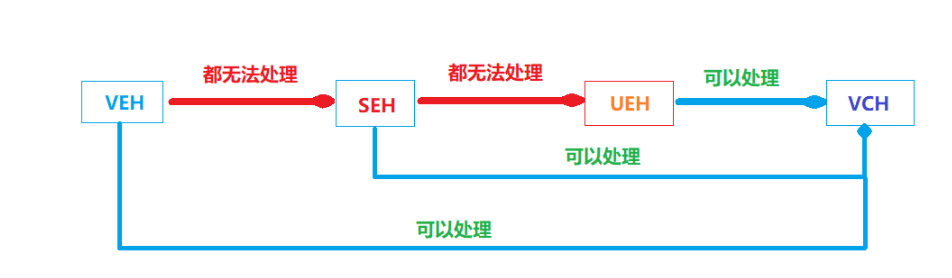

[TOC]

# 一、Windows编程基础

## 1. windows 基础概念

- Windows是一个**基于消息**模型**面向对象**的**分时**操作系统
- Windows GUI程序的入口函数: **WinMain**

## 2. Windows 编程框架

1. 创建窗口类：**WNDCLASS** WndClass = { 0 };
   - 重点是**窗口类名**和消息**回调函数**
2. 注册窗口类：**RegisterClass()**
3. 创建窗口：**CreateWindow()**
4. 显示窗口：**ShowWindow()**
5. 更新窗口：**UpdateWindow()**
6. 消息循环：
   1. 获取消息：**GetMessage()** \ PeekMessage
   2. 转换消息：**TranslateMessage()**  
      1. WM_KEYDOWN+WM_KEYUP -> WM_CHAR
   3. 分发消息：**DispathMessage()**

## 3. Windows 中的消息

- #### 消息的种类

  - 窗口消息：与窗口的内部运作有关，创建窗口(WM_CREATE)，绘制窗口(WM_PAINT)，销毁(WM_DESTORY)窗口等。
  - 控件消息：**WM_COMMAND** 消息，通常由控件产生，菜单和按钮等
  - 通知消息：特指 **WM_NOTIFY** 消息，只适用于标准控件(列表、树等)
  - 自定义消息：用户定义的消息，消息码需要**大于 WM_USER**

- #### 队列消息和非队列消息

  - 队列消息：被传输到消息队列中的消息
    - 例如 **WM_KEYDOWN**、**WM_MOUSEMOVE**等用户输入产生的消息
    - 使用 **PostMessage** 可以发送队列消息，非阻塞的
  - 非队列消息：直接发送给回调函数的消息，通常来自特定函数
    - 例如 **WM_CREATE** 由**CreateWindow** 产生，**WM_SHOWWINDOW **由 **ShowWindow** 产生
    - 使用 **SendMessage** 可以发送非队列消息，是阻塞的。

- ### 常见的消息类型

  |     WM_CREATE      |   WM_NCCREATE    |    WM_INITDIALOG     |   WM_DESTORY   |
  | :----------------: | :--------------: | :------------------: | :------------: |
  |    WM_NCDESTORY    |                  |                      |                |
  |     WM_SIZING      |   **WM_SIZE**    |     **WM_MOVE**      |   WM_MOVING    |
  | **WM_LBUTTONDOWN** | **WM_LBUTTONUP** | **WM_LBUTTONDBLCLK** |  WM_MBUTTONDO  |
  |    WM_MBUTTONUP    |   WM_MBUTTONUP   |   WM_MBUTTONDBLCL    |  WM_RBUTTONDO  |
  |    WM_RBUTTONUP    |   WM_NCHITTEST   |   WM_RBUTTONDBLCLK   |                |
  |   **WM_KEYDOWN**   |   **WM_KEYUP**   |    WM_SYSKEYDOWN     |  WM_SYSKEYUP   |
  |    **WM_CHAR**     |                  |                      |                |
  |      WM_PAINT      |   WM_SETREDRAW   |    WM_ERASEBKGND     |                |
  |    **WM_TIMER**    |                  |                      |                |
  |    WM_SETFOCUS     |   WM_KILLFOCUS   |     WM_ACTIVATE      | WM_ACTIVATEAPP |
  |  WM_MOUSEACTIVATE  |                  |                      |                |
  |     WM_VSCROLL     |    WM_HSCROLL    |                      |                |
  |   **WM_COMMAND**   |  **WM_NOTIFY**   |                      |                |
  |     WM_GETTEXT     |    WM_SETTEXT    |    WM_TIMECHANGE     |                |
  |     WM_COMMAND     |    WM_ENABLE     |    WM_SHOWWINDOW     |                |
  |  **WM_COPYDATA**   |                  |                      |                |

## 4. 窗口和对话框

- #### 三大窗口风格

  - WS_OVERLAPPEDWINDOW：重叠窗口
  - WS_CHILDWINDOW：子窗口，通常是子控件
  - WS_POPUPWINDOW：弹出窗口

- #### 窗口(控件)的创建方式

  - **CreateWindow**
  - 在windows中消息循环时线程相关的

- #### 对话框的创建方式

  - 模态对话框：**DialogBox()**
  - 非模态对话框：**CreateDialog()**

- #### 对话框和窗口的区别

  - 创建的函数不同
  - 创建时产生的消息不同， WM_CREATE  WM_INITDIALOG
  - 回调函数的返回值不同，窗口通常返回 DefWindowProc()，对话框返回True或者False
  - 对话框自带消息循环，而窗口需要用户创建
  - 对话框可以由资源创建，窗口不可以
  - 对话框不需要调用ShowWIndow，但是窗口需要

- #### 常见的窗口函数

| CreateWindow         | MessageBox       | GetMessage                      |
| -------------------- | ---------------- | ------------------------------- |
| RegisterClass        | GetDlgItem       | PeekMessage                     |
| DialogBox            | GetDlgCtrlID     | TranslateMessage                |
| CreateDialog         | GetDlgItemText   | DispatchMessage                 |
| SendMessage 非队列   | SetDlgItemText   | DefWindowProc                   |
| PostMessage 队列消息 | EnumChildWindows | **GetWindowLong** (GWL_)        |
| ShowWindow           |                  | **SetWindowLong**(SetClassLong) |

## 5. 动态链接库

- #### DllMain入口函数

  - DllMain 函数不是用户必须提供的。
  - 函数原型：BOOL WINAPI DllMain(HINSTANCE hinstDLL, DWORD fdwReason, LPVOID lpvReserved);
    - 参数一、当前DLL的加载基址，即模块句柄
    - 参数二、当前的DLL在什么情况下被加载的。记得加break;
      - #define DLL_PROCESS_ATTACH   1 进程创建
      - #define DLL_THREAD_ATTACH    2  线程创建
      - #define DLL_THREAD_DETACH    3  线程结束
      - #define DLL_PROCESS_DETACH   0  进程结束

- #### 动态链接库的导出方式

  1. ##### 在函数声明前使用 __declspec(dllexport)

     - C++中使用这种方式导出的函数在被其它语言调用时会出现错误，因为C++为了区分**重载函数**使用的名称粉碎机制会对函数名进行一些特殊的处理，导致其它程序无法正确的获取函数名称。为了解决这个问题，一般在函数前面再加一个 extern "C"，表示使用C方式的函数命名规则。

     - extern "C" __declspec(dllexport) void Func(int a, int b);

  2. ##### 使用模块定义文件进行声明(.def)  推荐使用

     - 配置方式: 项目属性 -> 连接器 -> 输入 -> 模块定义文件 -> 定义的.def文件

     - **以模块定义文件导出的函数默认没有名称粉碎机制**

     ```cpp
     模块定义文件基础用法:
     1. 指定导出表中显示的DLL名称：LIBRARY XXXX
     2. 以序号方式导出函数：[FuncName]  @[Number]
     3. 只以序号导出函数: [FuncName]   @[Number [NONAME]] VS2017中至少需要一个名称导出的函数
     ```

- #### 显式链接和隐式链接

  - **显式链接**：用于动态库(dll)，调用 LoadLibrary 和 GetProcAddress 动态获取函数
    - 不会影响程序的大小，便于升级，但是不易于跨平台
  - 隐式链接：用于静态库(lib)，使用 #pragma comment(lib, "xxx.lib") **链接静态库**并**包含头文件**
    - 特点：可能导致目标程序变大，但是增强了移植性

## 6. MFC编程

- ### MFC基础知识

  - MFC的入口函数在哪里: C**My**WinApp::InitInstance()
  - 使用MFC必须要定义唯一一个继承自 **CWinApp** 的类的**全局**对象
  - 实现消息映射用到的宏: BEGIN_MESSAGE_MAP 、END_MESSAGE_MAP

- ### MFC中的一些成员函数

  - **DoModal**: 创建一个模态对话框
  - **Create:** 创建一个非模态对话框，需要**showwindow**函数显示
  - EnableWindow：禁用或启用一个窗口(控件)
  - **UpdateWindow**: 传入 False 表示更新数据到控件
  - GetDlgItem: 通过窗口ID获取窗口句柄
  - GetDlgItemText: 设置窗口的标题（内容）

- **标准控件(列表、树)有哪些、普通的控件有哪些**

# 二、Windows编程提高

## 1. 内核对象

- #### 什么是内核对象

  - 操作系统中的三种对象：GDI对象(GDI32) USER对象(User32) 内核对象(kernel32)
    - 其中，GDI对象和USER对象在所有应用程序中的值都是固定的。
  - 内核对象本**质上是一个结构体**，但是这个结构体**处于内核层**，在用户层，只能通过操作系统提供的接口进行间接的访问。
  - 常见的内核对象有：**进程，线程，文件，邮槽，IOCP，事件** 等

- #### 内核对象的特点：

  - **全局性**：内核对象是跨进程的，可以在不同进程中访问同一个对象，通常使用字符串或ID标识一个对象。
  - **引用计数**：每一个内核对象都有一个引用计数，当创建或者打开一个内核对象的时候，引用计数会+1，当关闭一个内核对象的时候，引用计数会-1，当引用计数为0时，内核对象会被销毁。
  - **安全性**：除IOCP对象，所有的内核对象都需要传入**安全描述符**用于控制访问权限。
  - **句柄表**：每一个进程都有一个句柄表，相同的内核对象在不同的进程中，可能句柄值是不一样的。

## 2. 文件操作

- #### 文件操作相关函数

  - 不需要传入句柄
    - 删除文件：DeleteFile 
    - 拷贝文件：CopyFileA
    - 移动文件：MoveFileA
    - 获取文件属性：GetFileAttributesExA
  - 需要传入句柄
    - 打开\创建文件： CreateFile，失败返回 INVALID_HANDLE_VALID(-1)
    - 获取文件指针：SetFilePointer
    - 读取\写入数据: Read\WriteFile
    - 获取文件大小：低位 = GetFileSize(文件句柄，大小的高位)
    - 设置文件结尾:  SetEndOfFile
  - 遍历文件API
    - FindFirstFile 、 FindNextFile、 注意 " \ * "，遍历文件需要排除 . ..

## 3. 进程和模块

- #### 什么是进程

  - 进程可以看作是一个运行中的程序，应该由一个可执行程序(.exe)产生。一个进程最少包含了一个进程内核对象、一个线程内核对象、一块虚拟地址空间(4GB)、需要用到的模块。**不执行代码** 

- #### 什么是模块

  - windows下的可执行文件通常被称作模块，用于提供必须的数据以及代码。

- #### 进程的类型

  - GUI程序：窗口程序，入口为 (w)WinMain
  - CUI程序：控制台程序，入口为 (w)main

- #### 进程的相关函数

  - 创建进程：CreateProcess、WinExec、system、ShellExecute 等
  - 结束进程：TerminateProcess、 ExitProcess
  - 打开进程：OpenProcess，不同的操作需要传入不同的权限
  - 获取当前的句柄：GetCurrentProcess() 返回的是伪句柄，使用 DumplicateHandle进行转换
  - 获取当前PID：GetCurrentProcessId()，pid和tid使用的是同一个序列
  - 遍历进程：CreateToolhelp32Snapshot \ Process32First \ Process32Next

- #### 进程通信的方式：

  - 邮槽、套接字、WM_COPYDATA、**文件映射**

## 4. 线程和线程同步

- #### 线程的基本概念
  - 线程其实可以理解为一段正在执行中的代码，它最少由一个线程内核对象和一个栈组成。
  - 线程之间是没有从属关系的，同一进程下的所有线程都可以访问进程内的所有内容。
  - 主线程其实是创建进程时创建的线程，主线程一旦退出，所有子线程也会退出。

- #### 线程的相关函数

  - 创建线程：CreateThread、_beginthreadex()
  - 结束线程：TerminateThread、_endthreadex()、ExitThread
  - 等待线程：WaitForSingleObject
  - 挂起线程：SuspendThread
    - 线程有挂起次数，挂起多少次就要恢复多少次
  - 恢复线程：ResumeThread
  - 切换线程：SwitchToThread  Sleep
  - 遍历线程：CreateToolhelp32Snapshot、Thread32First、Thread32Next
    - **无论PID传入的是什么，遍历到的都是所有线程**

- #### 线程的退出方式

  1. **主线程函数(main\WinMain)返回，最为友好，会调用析构函数、会清理栈**
  2. 使用ExitThread：不会调用析构函数
  3. 使用TerminateThread：不会调用析构函数，不会清理栈
  4. 结束进程：可能来不及保存工作结果

- #### 线程的优先级

  - 线程只有相对于进程的优先级，随着进程优先级的改变，线程的相对优先级并不会改变
  - *通常情况下手动修改优先级并不会对程序的执行产生变化*

- #### 线程环境

  - 线程环境指的是一个线程当前的执行状态，包括了当前执行到了那里，局部变量和参数有哪些等。
  - windows是一个**分时系统**，当一个线程时间片用完时，会保存当前线程的执行状态，并且切换到新的线程，同时将新线程上次的执行状态恢复。这就是线程切换的基本原理
  - 使用 **GetThreadContext** 和 **SetThreadContext** 可以获取和设置线程环境
    - 记得给结构体的第一个字段传参。

- #### 线程同步

- ##### 同步和互斥

  - 同步：就是按照一定的规则执行不同的线程
  - 互斥：当一个线程进行一系列操作的时候，其它线程不能进行同样的操作

- ##### 用户层的线程同步

  - ###### 原子操作(Interlocked...)

    - **HOOK的时候用于填充OPCODE**
    - 特点：将一条语句转换成了具有同等功能的单条汇编指令 lock
    - 缺点：只能给单个整数类型(4/8)进行保护，不能给使一段代码变成原子操作
    - 函数：
      - InterlockedExchange 交换两个数【关键】inline hook 中会用到
      - InterlockedIncrement 自增

  - ###### 临界区(CriticalSection)

    - 特点：拥有线程拥有者的概念，同一个线程可以不断的重新进入临界区，但是进入了多少次，就要退出多少。
    - 缺点：一旦拥有临界区的线程崩溃，那么所有等待临界区的线程就会产生死锁。
    - 函数：
      - 初始化： InitializeCriticalSection
      - 保护：EnterCriticalSection
      - 结束保护 ：LeaveCriticalSection
      - 删除：DeleteCriticalSection

- ##### 内核层的线程同步

  - ###### 等待函数(WaitForObject)

    - 等待函数的形式
      - 单个：WaitForSingleObject
      - 多个：WaitForMultipleObjects

    - 一个可以被等待的对象通常由两种状态，分别是：
      - 可等待(激发态)(有信号)：等待函数【不会阻塞】
      - 不可等待(非激发态)(无信号)：等待函数需要等待一定时长并【阻塞】

    - 等待函数的副作用：
      - **改变被等待对象的信号状态**

  - ###### 互斥体(Mutex)

    - 特点：拥有临界区的线程拥有者概念，但是线程**崩溃不会死锁**，执行较慢
    - 函数
      - 创建：CreateMutex，如果第二个参数是FALSE，那么就是可等待
      - 打开：OpenMutex
      - **保护：WaitForSingleObject： 把互斥体置为不可等待**
      - **离开保护：ReleaseMutex把互斥体置为可等待**
      - 关闭：CloseHandle

  - ###### 事件(Event)

    - 特点：可以手动选择是否产生副作用，如果设置为手动状态，那么就不产生副作用
    - 函数：
      - 创建：CreateEvent()
      - 打开：OpenEvent()
      - **保护：WaitForSingleObject()**
      - 设置为非激发态：ResetEvent()
      - **退出（设置为激发态）：SetEvent()**
      - 关闭：CloseHandle

  - ###### 信号量（Semaphore）

    - 特点：有多把锁，可以控制活动线程的数量
    - 函数：
      - 创建：CreateSemaphore
      - 打开：OpenSemaphore
      - **上锁：WaitForSingleObject**
      - **解锁：ReleaseSemaphore**
      - 关闭：CloseHandle

## 5. 同步IO和异步IO

- #### 同步和异步

  - 同步：以普通的方式读写一个文件就是同步IO，当读写的数量较大的时候，所在线程会阻塞
    - ReadFile() \ WriteFile
  - 异步：以重叠IO的方式读写一个文件的操作，它会在调用IO函数的时候提交一个IO请求给操作系统，然后函数不等IO 操作执行完毕继续往下执行，当IO操作结束时，操作系统会以某种方式返回一个信号。

    - 在打开文件的时候必须指定 FILE_FLAG_OVERLAPPED 标记
    - 必须在读写函数内传入 OVERLAPPEND 结构体
    - 当使用重叠IO的时候，Read|WriteFile 的第四个字段可以传入 NULL
    - 在重叠IO中文件指针是没有用的，需要使用 OVERLAPPEND 结构体中的Offset(High)字段进行设置

- #### 异步操作 - 等待句柄

  ```cpp
  // 缺点：当IO请求过多的时候，不知道等待完成的是哪一个IO操作
  #include <iostream>
  #include <windows.h>
  using namespace std;
  
  int main()
  {
  	// 1. 打开一个文件
  	HANDLE FileHandle = CreateFileA(
  		"F:\\test.txt", GENERIC_ALL, NULL,
  		NULL, OPEN_EXISTING, FILE_FLAG_OVERLAPPED, NULL);
  
  	// 2. 进行读写操作
  	CHAR Buffer[0x100] = { 0 };
  	OVERLAPPED OverLappend = { 0 };    // 使用重叠IO必须的结构体
  	OverLappend.Offset = 4;
  	ReadFile(FileHandle, Buffer, 0x100, NULL, &OverLappend);
  
  	// 3. 通过等待文件句柄可以知道一个IO操作是否完成
  	WaitForSingleObject(FileHandle, INFINITE);
  
  	return 0;
  }
  ```

- #### 异步操作 - 等待对象

  ```cpp
  // 相对于等待句柄来说，可以识别是哪一个IO操作完成了
  #include <iostream>
  #include <windows.h>
  using namespace std;
  
  int main()
  {
  	// 1. 打开一个文件
  	HANDLE FileHandle = CreateFileA(
  		"F:\\test.txt", GENERIC_ALL, NULL,
  		NULL, OPEN_EXISTING, FILE_FLAG_OVERLAPPED, NULL);
  
  	// 2. 进行读写操作(读取0~5)
  	CHAR BufferA[0x100] = { 0 };
  	OVERLAPPED OverLappendA = { 0 };   // 使用重叠IO必须的结构体
  	OverLappendA.Offset = 0;
  	OverLappendA.hEvent = CreateEvent(NULL, FALSE, FALSE, NULL);
  	ReadFile(FileHandle, BufferA, 0x5, NULL, &OverLappendA);
  
  	// 3. 进行读写操作(读取6~10)
  	CHAR BufferB[0x100] = { 0 };
  	OVERLAPPED OverLappendB = { 0 };   // 使用重叠IO必须的结构体
  	OverLappendB.Offset = 6;
  	OverLappendB.hEvent = CreateEvent(NULL, FALSE, FALSE, NULL);
  	ReadFile(FileHandle, BufferB, 0x5, NULL, &OverLappendB);
  
  	// 3. 通过等待文件句柄可以知道一个IO操作是否完成
  	WaitForSingleObject(OverLappendA.hEvent, INFINITE);
  	WaitForSingleObject(OverLappendB.hEvent, INFINITE);
  
  	return 0;
  }
  ```

- #### 异步操作 - APC函数

   - APC队列： 异步过程调用队列，保存的是一组函数的地址以及需要的参数
      - APC队列内的函数在什么时候调用？当线程属于闲暇状态(可警醒)的时候会查看当前的APC队列是否存在函数，如果存在函数就会一一调用，如果不存在就会休眠或者继续执行。
       - 投递的请求并不一定按照投递顺序完成

   - APC队列中的函数是根据完成的顺序放入的

   -  APC队列时线程相关的，每一个线程都有一个APC队列

     ```cpp
       #include <iostream>
       #include <windows.h>
       using namespace std;
       
       CHAR BufferA[0x100] = { 0 };
       CHAR BufferB[0x100] = { 0 };
       
       // IO操作完成后操作系统会向APC队列添加一个这样的函数
       VOID WINAPI OverLappedRoutine(
       	DWORD dwErrorCode, // 错误码
       	DWORD dwNumberOfBytesTransfered,// 实际操作的字节数
       	LPOVERLAPPED lpOverlapped  // 重叠IO结构体
       )
       {
       	// 判断当前时哪一个消息
       	if (lpOverlapped->hEvent == (HANDLE)0x01)
       	{
       		printf("%s\n", BufferA);
       	}
       	else
       	{
       		printf("%s\n", BufferB);
       	}
       }
       
       int main()
       {
       	// 1. 打开一个文件
       	HANDLE FileHandle = CreateFileA(
       		"F:\\test.txt", GENERIC_ALL, NULL,
       		NULL, OPEN_EXISTING, FILE_FLAG_OVERLAPPED, NULL);
       
       	// 2. 进行读写操作(读取0~5)
       	OVERLAPPED OverLappendA = { 0 };   // 使用重叠IO必须的结构体
       	OverLappendA.Offset = 0;
       	OverLappendA.hEvent = (HANDLE)0x01;
       	ReadFileEx(FileHandle, BufferA, 0x5, &OverLappendA, OverLappedRoutine);
       
       
       	// 3. 进行读写操作(读取6~10)
       	OVERLAPPED OverLappendB = { 0 };   // 使用重叠IO必须的结构体
       	OverLappendB.Offset = 6;
       	OverLappendB.hEvent = (HANDLE)0x02;
       	ReadFileEx(FileHandle, BufferB, 0x5, &OverLappendB, OverLappedRoutine);
       
       	// 将线程设置为可警醒状态
       	SleepEx(0, TRUE);
       
       	return 0;
       }
   // 最常使用的是完成那个端口模型
     ```

# 三、Windows原理

## 1. 权限管理

- #### 相关名词

  - SID(*System IDentifier*):安全描述符，用于标识用户身份 
  - LUID: 局部唯一标识符，系统每次启动都可能变化
  - GUID: 全局唯一标识符，一直都保持不变
  - UAC(*User Account Control*): 用户账户控制，vista开始启用

- 相关函数

  - 获取进程令牌: OpenProcessToken
  -  获取线程令牌: OpenThreadToken
  - 获取令牌信息: GetTokenInformation
  - 查询特权名称的LUID: LookupPrivilegeValue
  - 修改令牌权限: AdjustTokenPrivileges
  - **创建管理员进程: ShellExecute 传入 runas**

## 2. 内存管理

- #### Window的内存布局

  - 每个进程都有单独的4GB空间，布局通常如下
    1. 0x00000000~0x0000FFFF : 空指针赋值区
    2. 0x00010000~0x7FFF0000 : 用户领空
    3. 0x7FFF0000~0x7FFFFFFF : 64Kb禁入分区
    4. 0x80000000~0xFFFFFFFF : 系统领空

- #### 虚拟内存的三种状态

  - 闲置：没有和物理内存以及虚拟内存建立关联
  - 预定（保留）：没有和物理内存建立关联，但是占用了虚拟空间
  - 提交：和物理内存建立了关联，可以直接使用

- #### 虚拟内存的映射方式

  - 私有: 其它进程不可直接访问的空间
  - 映射(mapped)：内存映射文件
  - 映像(image)：通常是可执行文件和模块

- #### 内存的分页属性

  - 只读,可读可写,可读可执行, 可读可写可执行, **写时拷贝**
  - Windows的模块通常都拥有写时拷贝属性

- #### 内存管理方式

  - ##### 堆内存：通常用于进行小块内存的分配

    - 获取默认堆空间：GetProcessHeap()
    - 创建新的堆空间：HeapCreate()
    - 在堆中申请内存：**HeapAlloc()**   
      - 申请的空间以 8 字节对齐，使用HEAP_ZERO_MEMORY可以初始化
    - 重新申请空间: HeapReAlloc()
    - 释放堆空间：**HeapFree()**
    - 删除堆空间：HeapDestroy()

  - ##### 虚拟内存：通常用于大片内存的管理

    - 申请内存：**VirtualAlloc**(首地址，大小，申请方式，分页属性)
      - 指定的首地址必须是分配粒度的倍数(0x10000)
      - 分配的内存大小会被对齐到分页大小(0x1000)的整数倍
      - 如果只保留了内存空间，那么不能进行访问
    - 修改分页属性 **VirtualProtect**()
    - 释放虚拟内存 VirtualFree()
    - 远程写进程内存： **WriteProcessMemory**
    - 远程读进程内存： **ReadProcessMemory**
    - 查看虚拟内存属性: VirtualQuery
    - **注：当使用 [EX] 版本的函数时，可以对其它进程进行操作**

  - ##### 文件映射：可用于进程通信和大文件的操作

    - 创建文件映射对象： CreateFileMappingA 
      - 可以映射一个文件，也可以映射一块内存
    - 关联文件到内存：**MapViewOfFile**
    - 刷新内存数据到文件：FlushViewOfFile
    - 取消关联：UnmapViewOfFile

## 3. 模块注入

- ##### 常见的注入方式: 

  - **消息钩子注入**
  - **远程线程注入**
  - 注册表注入
  - **劫持模块注入**
  - COMRes注入
  - APC注入
  - 输入法注入

## 4. HOOK技术

- #### 远程线程注入的流程

   1. 确认需要注入的程序并获取目标进程的句柄：**GetWindowThreadProcesssId()** **OpenProcess()**;
   2. 在目标进程内申请空间： **VirtualAllocEx(Process)**;
   3. 向空间内写入dll名称：**WriteProcessMemory(IatHookDllName)**;, DLL名称需要是绝对路径
   4. 创建远程线程, 关键函数： **CreateRemoteThread(LoadLibrary(A/W)**;
   5. 等待线程执行结束：WaitForSingleObject(Thread, INFINITE);
   6. 释放空间：**VirtualFreeEx(Process, Buffer, 0, MEM_RELEASE);**
   7. 关闭句柄：CloseHandle();

- ### message hook

  - windows操作系统维护了一个钩子链，可以通过函数向其中添加或删除函数
    - 添加钩子: SetWindowsHookEx， 钩子的类型
    - 取消钩子: UnhookWindowsHookEx
    - 调用下一个钩子函数：**CallNextHookEx** 通常是必须调用的

- ### iat(eat) hook

   - #### IAT HOOK的流程

      - 原理是修改导入地址表中对应的函数地址

      1. 找到想要HOOK的函数，获取函数原型并实现自己的对应函数

         ```cpp
         HANDLE WINAPI MyHookFunc()
         {
         	if (满足HOOK条件)
             {
                 // 执行自己想执行的代码
             }
             else
             {
         		// 调用原函数
                 OldFunc();
             }
         }
         ```

      2. 遍历目标进程的导入表，找到指定模块，并找到模块中对应函数所在IAT中的地址

      3. 修改内存属性，将新的函数地址写入到IAT表中，修改完后恢复。

      4. 卸载： 将保存的原函数地址重新写入到IAT中

   - **注：可以使用GetProcAddress函数过掉 IATHook **

- ### inline hook

   - inline Hook 可用于内核层和用户层，可以hook代码的任意位置

   - #### inline  HOOK 的流程

     1. 找到想要HOOK的函数，获取函数原型并实现自己的对应函数

        - ```cpp
          HANDLE WINAPI MyHookFunc()
          {
          	if (满足HOOK条件)
              {
                  // 执行自己想执行的代码
              }
              else
              {
          		// 先修复原有的5字节
                  OffHook();
          		// 调用原函数
                  OldFunc();
          		// 为了下一次继续进入当前函数，需要再次Hook
          		OnHook();
              }
          }
          ```

     2. 获取目标函数的地址并保存，用于卸载 HOOk（GetProcAddress）

     3. 通过 **新函数的位置 - 目标函数的位置 - 5(E9XXXXXXXX)** 求得跳转偏移

     4. 使用偏移构建跳转指令并写入到目标函数的执行流程中

        - 写入的时候是**非线程安全的**， 使用原子操作，**暂停其它所有线程**

     5. **注：写入代码时需要修改并还原保护属性**

   - **注：可以使用指令比对，hash计算的方式检查是否被内联HOOK**


# 四、调试和异常

## 1. 异常原理

- #### 中断和异常

  - 中断由外部因素产生。如键盘，鼠标消息。
  - 异常是系统或软件内部访问执行错误产生的，如除零错误，页错误。

- #### 异常的种类

  - 陷阱: 可恢复，恢复后继续在异常发生地址的下一条指令执行(软件断点，硬件读写断点)
  - 错误: 可恢复，恢复后继续在异常发生地址处执行(内存断点)
  - 终止: 不可恢复，退出进程

- #### Windows中的异常处理机制

  - #### 异常的执行优先级

    

  - #### VEH: 向量化异常处理

    - 进程相关，可以有多个，最先执行
    - 添加： AddVectoredExceptionHandler
    - 移除： RemoveVectoredExceptionHandler

  - #### VCH: 向量化异常处理

    - 进程相关，可以有多个最后执行
    - 添加： AddVectoredContinueHandler
    - 移除： RemoveVectoredContinueHandler

  - #### UEH: 顶层异常处理函数

    - 进程相关，只存在一个，谁都处理不了就执行，进程被调试时不会被执行
    - 注册：SetUnhandledExceptionFilter

  - #### SEH: 结构化异常处理程序

    - 线程相关，保存在 FS:[0]的位置，关键字 __ try,__ except,__ finally, __ leave

    - __ try的后面必须有一个__ except或__ finally块，中间不能有其他代码

    - 应该使用 __ leave 离开当前的 __ try 语句块，而不是使用 return go 等

    - ##### 组合方式

      1. __ try{} __ except(){} 捕获并处理异常
      2. __ try{} __ finallyP{} 无论是否产生异常都执行
      3. 异常可以嵌套，但是不能同时使用 __ except 和 __finally 

    - ##### 过滤表达式

      1. EXCEPTION_EXCUTE_HANDLER(1)        异常已处理                   
      2. EXCEPTION_CONTINUE_SHEARCH(0)      交由上层处理
      3. EXCEPTION_CONTINUE_EXCUTION(-1)     重新执行一次

      - 过滤表达式可以是一个函数调用，但是必须返回以上三个值
        - 可以使用 GetExceptionCode 和 GetExceptionInformation 获取异常信息
        - 以上两个函数只能在过滤表达式中使用

    - ##### SEH链

      - SEH链，是个链表，保存这SEH的函数地址，链表的首地址保存在TEB的第一个字段中，通过FS寄存器来获取（FS：[0]）。链表中的每个元素都是这样一个结构体

        ```cpp
        // SEH 结构体
        typedef struct _EXCEPTION_REGISTRATION_RECORD {
            struct _EXCEPTION_REGISTRATION_RECORD *Next;
            PEXCEPTION_ROUTINE Handler;
        } EXCEPTION_REGISTRATION_RECORD;
        
        // SEH函数原型
        EXCEPTION_DISPOSITION
        NTAPI
        EXCEPTION_ROUTINE (
            _Inout_ struct _EXCEPTION_RECORD *ExceptionRecord,
            _In_ PVOID EstablisherFrame,
            _Inout_ struct _CONTEXT *ContextRecord,
            _In_ PVOID DispatcherContext
            );
        ```

  - #### 异常的分发流程

    - IDT：中断和异常是统一管理的，系统为每一种中断或异常都提供了处理函数，这些函数的地址就保存在IDT中，使用 `!idt /a` 查看IDT中的所有内容
    - 异常分发的源头 : CPU -> IDT -> KiDispatchException
    - 用户态异常分发的源头: KiUserExceptionDispatcher

## 2. 反调试与反反调试

- #### 静态反调试：一般在调试开始时阻拦调试者，调试者只需找到原因后可一次性突破

  - PEB： BeginDebuged、Ldr、Heap、NtGlobalFlag
  - TEB： StaticUnicodeString
  - 攻击调试器:  NtSetInformationThread(ThreadHideFormDebugger(0x11))
  - 查询调试信息：NtQueryInformationProcess()
  - 在TLS回调函数内：检查父进程、窗口名、进程名、文件和路径、注册表

- #### 动态反调试：可在调试过程中被频繁触发，因此需要调试者时时关注

  - 使用异常： 主动产生异常并在处理函数内反调试，SEH UEH等
  - 补丁检查： 检查执行流程中的0xCC，API是否被Hook，代码HASH值
  - 反反汇编： 指令截断、混淆、膨胀、代码乱序
  - 使用壳技术：加密函数，API虚拟机，指令虚拟机

## 3. 调试器的实现

- #### 调试器的实现流程

  1. CreateProcess(DEBUG_ONLY_THIS_PROCESS)  调试方式创建进程
  2. WaitForDebugEvent()，等待调试事件
  3. 根据异常类型处理异常(设置断点、清除断点、恢复断点等)
     1. Set\GetThreadContext()
     2. VirtualProtectEx()
     3. Write/ReadProcessMemory()
     4. OpenProcess\Thread()
  4. ContinueDebugEvent() 恢复程序的运行，重新返回第2步

- #### 断点的实现

  - ##### 单步断点的实现

    - 设置 flag 标志位中的 TF 位为1

  - ##### 硬件断点的实现

    1. 在Dr0~Dr3中设置断点地址
    2. 在Dr7中设置断点的类型、长度并且激活断点
    3. 断点命中后在Dr6的低4位获取触发的位置

  - ##### 软件断点的实现

    1. 在目标代码的执行流程中修改指令为 int3 并保存原有指令
    2. 断点断下后恢复原有的数据
    3. **将EIP指向的位置 - 1 **

  - ##### 内存断点的实现

    1. 通过设置内存断点为不可读写来触发异常

    - 由于分页属性都是以分页来设置，所以需要不断的重新设置，效率极低


# 五、密码学

## 1. 密码学概览

- ##### 加密方式的种类

  - 对称加密: 加密密钥和解密密钥相同
  - 非对称加密: 解密密钥和解密密钥不同

## 2. 对称加密

- ##### 历史上的对称加密方式

  - 凯撒加密：对数据进行简单的移位，枚举破解
  - 简单置换密码：对数据进行无规律的替换，可以使用字母频率分析法分析
  - 维吉尼亚密码：通过x/y的形式在码表上进行数据的替换，无法使用字母频率分析法

- ##### 目前常见的对称加密方式

  1. AES: 高级加密标准，目前的主流加密方式
  2. DES: 数据加密标准，基本不用了
  3. 3DES：根据密钥的不同，可能会产生 DES-EDE2、DES-EDE3 和 DES
  4. BASE64:  编码方式，产生的结果可能是 `Sdas48f64UI==`的形式

## 3. 非对称加密

- ##### 非对称加密的应用场景

  - https: 超文本传输安全协议，保障数据传输的安全性
  - 数字签名：分别使用公钥和私钥进行签名和验证
  - 数字证书：互联网通讯中标志通讯各方身份信息的一串数字，原理同上

- ##### 常见的非对称加密方式

  - RSA: 基于大整数分解的数学难题

## 4. 消息摘要算法

- ##### 消息摘要算法的特征

  - 消息摘要算法通常用于**验证数据的完整性**，目标数据即使有一个二进制的改动也会影响结果。
  - 不论需要计算的数据有多大，最终生成HASH值的长度都是固定且**不可逆**的。

- ##### 常见的消息摘要算法: 

  1. SHA1: 安全散列算法1,长度160bit
  2. MD5: 消息摘要算法5，长度128bit
  3. CRC32: 循环冗余校验，长度32bit
  4. SHA256: 长度为256bit的 安全散列算法2

- ##### 常见的用途：

  - 验证数据的完整性
  - 校验文件是否被修改
  - 数字证书签名，保护传输过程中的数据

# 六、汇编语言

## 1. 硬件基础

- ##### 计算机的三大总线

  1. 地址总线：用于传输需要访问的地址
  2. 控制总线：用于传输表示指令的二进制编码
  3. 数据总线：用于传输设置和得到的数据

- ##### 实模式与保护模式

  - 实模式中寻址方式是**段基址+段偏移**， 例如 CS*0x10 + IP，能访问20位的**物理地址**
  - 保护模式中的实际基址存储在段描述符中，访问到的是 **虚拟的4GB空间**

## 2. 寄存器

- 16位寄存器
  - 通用寄存器: ax、cx、dx、bx、si、di、sp、bp
  - 栈寄存器: sp、bp
  - 变址寄存器: si、di
  - 段寄存器: CS、DS、SS、ES
  - 指针指针: ip 
  - 标志寄存器：ZF、CF、OF、PF、SF、DF、TF 、IF、AF
    1. ZF：**零标志位，结果为0的时候置1**
    2. PF：奇偶标志位，低8位1的个数为偶数个的时候置1，否则置0
    3. SF**：符号标志位，符号位为1的时候置1，否则置0**
    4. DF：**方向标志位，1说明向高地址+1，否则向低地址-1**
    5. CF：**进位标志位，无符号数计算结果影响**
    6. OF：**溢出标志位，有符号运算结果影响其置位**
       1. 两个正数相加的和是负数
       2. 两个负数相加的和是正数
    7. **TF: 陷阱标志位**
    8. AF: 辅助进位标志位
    9. IF：**中断允许标志位**
- 32位寄存器
  - EAX、ECX、EDX、EBX、ESI、EDI、ESP、EBP、
  - EIP、CS、DS、SS、ES、**FS** 、**GS** 、EFLAG
- 64位寄存器
  - EAX、ECX、EDX、EBX、ESI、EDI、ESP、**R8-R15**
  - EBP、EIP、CS、DS、SS、ES、**FS** 、**GS** 、EFLAG

## 3. 寻址方式

- 立即数寻址  0x401000
- 寄存器寻址  eax
- 存储器寻址
	- 存储器-直接寻址: [0x1000]
	- 存储器-寄存器间接寻址: [si]
	- 存储器-相对寄存器寻址: [si+4]
	- 存储器-基址变址寻址  : [si+bx]
	- 存储器-相对基址变址寻址  : [si+bx+4] 

## 4. 汇编指令

- ##### 数据传输指令

  - mov, xchg,lea 

- ##### 算术运算指令

  - add , inc ,sub, dec, div,mul

- ##### 位操作指令

  - shr,shl,rol,ror,and,or,xor

- ##### 串操作指令

  - movs, loads(eax,esi),stos(eax,edi),scas
  - 使用 cld 指令控制方向
  - 隐含的执行次数需要放置于cx/ecx
  - 通常和rep/repne相配合
  - 隐含的目的操作数: edi、源操作数  : esi
  - 会自动自增/自减目的操作数和源操作数

- ##### 条件跳转指令(JCC)

  - jz,jnz,jb,jg,jle,jge (了解是受到哪些标志位的影响)
  - 控制转移指令
   - call , ret , iret(了解怎么操作栈) ,jmp

- 逻辑运算指令

  - AND、OR、XOR、NOT、TEST

## 5. 内联汇编和裸函数

- 使用 __asm { } 进行内联函数的编写
- 使用 __emit() 定义一个一字节的常量数值
- x64 不支持内联函数的编写
- 使用 __declspec(naked) 定义裸函数
  - 裸函数内不能使用return指令
  - 裸函数不会自动生成代码，需要用户开辟栈帧

# 七、网络编程与数据库

## 1. TCP/IP 模型

1. **应用层： 用于提供常见的网络应用服务**
   - **FTP、POP3、SMTP、HTTP(S)、DHCP、DNS**

2. **传输层：提供端口到端口之间的通信功能**
   - **TCP(传输控制协议)、UDP(用户数据包协议)**

3. 网络互连层：用于在IP主机和路由间传输信息
   - IP、ICMP、ARP

4. 网络接口层：用于将数据从一个设备传输到另一个设备
   -  SLIP、PPP

## 2. 网络编程

- #### 网络编程基础

  - 在Windows中，无论使用何种方式进行网络编程，**第一个调用**的函数始终是**WSAStartup()**
  - 套接字分为三种，分别是**流式套接字(TCP)**，**数据包套接字(UDP)**，原始套接字(RAW)
  - 在网络传输中，通常使用的是大端模式，可以通过 **htonX** 函数将主机序(小端)转为网络序(大端)

- #### 什么是TCP？

  - TCP是一种**面向连接的**、**可靠的**的**传输层**通信协议。
  - TCP网络编程中的**服务器**流程:
    1. WSAStartup()  初始化网络环境，必须第一个调用
    2. socket() 创建套接字需传入 *SOCK_STREAM* 和 *IPPROTO_TCP*
    3. **bind()** 绑定套接字到当前端口
    4. **listen()** 监听端口
    5. **accept()** 等待客户端的连接
    6. send()/recv() 发送\接受数据
    7. closesocket() 关闭套接字
    8. WSAClearn() 清理网络环境
  - TCP网络编程中的**客户器**流程:
    - WSAStartup() -> socket() -> **connect()** -> send()/recv() -> closesocket() -> WSAClear;
    - 客户端不需要绑定端口设置接听，需要使用connect连接目标服务器

- #### 什么是UDP？

  - UDP是一种**面向无连接的**、**不可靠**的**传输层**通信协议。
  - UDP的**服务器**和**客户端**的编写流程
    1. WSAStartup()  初始化网络环境，必须第一个调用
    2. socket() 创建套接字需传入 *SOCK_DGRAM* 和 *IPPROTO_UDP*
    3. **bind()** 绑定套接字到当前端口
    4. **sendto()/recvfrom()** 发送\接受数据
    5. closesocket() 关闭套接字
    6. WSAClearn() 清理网络环境
  - 因为UDP传输基于无连接，所以没有等待连接和连接的部分

## 3. SQL语法

- #### SQL约束

  - 主键(PRIMARY KEY): 唯一标识数据库表中的每条记录，通常有且**只能有一个**。
  - 外键(FOREIGN KEY)：一个表中的外键通常**绑定到另一个表的主键**，可以有多个。
  - 唯一(UNIQUE): 规定该字段的数据是**唯一的**，可以有多个。
  - 非空(NOT NULL): 规定该字段**不能为NULL**，可以有多个。
  - 默认(DEFAULT)：指定当不设置数据时的**默认值**，可以有多个。
  - 检查(CHECK): 用于**检查**设置的值是否合理，可以有多个。

- ####  数据库指令

  ```mysql
  # 创建一个不存在的数据库并指定编码
  CREATE DATABASE IF NOT EXISTS test;
  
  # 删除一个已存在的数据库
  DROP DATABASE IF EXISTS test;
  
  # 显示所有的数据库
  SHOW DATABASES;
  ```

- #### 表操作指令

  ```mysql
  # 创建一个表
  Create table 表名
  (
  	Id		int				primary key,					#主键约束
  	Name	varchar(20)		unique,							#唯一约束
  	Age		int				not null,						#非空约束
  	Sex		varchar(5) 		check(Sex=’男’ or Sex=’女’),	   #检查约束
  	Ethnic	varchar(5)		default  ’汉’					#默认约束
  );
  
  
  # 显示所有表
  SHOW TABLES;
  
  # 删除一张表
  DROP TABLE name;
  
  # 修改列名以及属性名
  ALTER TABLE table4 CHANGE name2 char(20);
  
  # 删除一个已存在的列
  ALTER TABLE table4 DROP name3;
  ```

- #### 项操作指令

  ```mysql
  # 向表中指定字段添加数据
  INSERT INTO name(column1, column2) VALUES (value1, value2);
  
  # 向表中添加多列数据
  INSERT INTO name(column1, column2) VALUES (1,2),(3,4);
  
  # 更新表中指定字段的所有数据
  UPDATE name SET column = xxx;
  
  # 更新表中满足条件的指定字段
  UPDATE name SET column = xxx [WHERE];
  
  # 删除表中的指定列
  DELETE FROM 表名 [WHERE];
  
  # 删除表中所有数据
  delete from 表名;
  
  ```

- #### 查询数据

  ```mysql
  # 查询表中的所有记录
  SELECT * FROM 表名;
  
  # 查找指定字段
  SELECT 字段名 FROM 表名;
  
  # 条件查询
  # 常见的比较运算符有: > < <= >= = <>
  # 可以使用 and or not 组成多个条件的判断
  SELECT 字段名 FROM 表名 WHERE 字段名 = ?;
  
  # 模糊查询: % 匹配任意长度字符
  select * from 表明 where name like '1%2'
  
  # 模糊查询: _ 匹配任意一个字符
  select * from 表明 where name like '_M_'
  ```