[TOC]

# 一、汇编语言与逆向

## 1. 汇编与逆向

- ### 函数调用约定

  - cdecl：C 语言的调用约定（VS 默认）

    - ```cpp
      int __cdecl cdecl_add(int a, int b)
      {
      	return a + b;
      }
      
      // 从右到左使用栈传参，函数[外]平衡堆栈
      int resultB = cdecl_add(1, 2);
      
      // push        2
      // push        1  
      // call        cdecl_add (0B1123Ah)  
      // add         esp,8  
      // mov         dword ptr [resultB],eax  
      ```

  - stdcall：标准调用约定（WINAPI）

    - ```cpp
      int __stdcall stdcall_add(int a, int b)
      {
      	return a + b;
      }
      
      // 从右到左使用栈传参，函数[内]平衡堆栈
      int resultA = stdcall_add(1, 2);
      
      // push        2
      // push        1
      // call        stdcall_add(0B1118Bh)
      // mov         dword ptr[resultA], eax
      ```

  - thiscall：成员函数调用约定

    - ```cpp
      class OBJ 
      { 
      public: 
      	int thiscall_add(int a, int b) { return a + b; }
      };
      
      OBJ object;
      // this 指针传入 ecx 寄存器，函数参数从右到左
      // 使用栈传参，函数[内]平衡堆栈
      int resultD = object.thiscall_add(1, 2);
      
      // 静态成员函数使用的是 cdecl 的调用约定
      int resultE = OBJ::static_add(1, 2);
      
      // push        2  
      // push        1  
      // lea         ecx,[object]  
      // call        OBJ::thiscall_add (0EC137Fh)  
      // mov         dword ptr [resultD],eax  
      ```

  - fastcall：快速调用约定

    - ```cpp
      int _fastcall fastcall_add(int a, int b, int c, int d, int e)
      {
      	return a + b + c + d + e;
      }
      
      // 如果参数小于三个，使用ecx,edx从左向右传参，超出
      // 两个的部分从右到左使用栈传参，函数[内]平衡堆栈
      int resultC = fastcall_add(1, 2, 3, 4, 5);
      
      // push        5  
      // push        4  
      // push        3  
      // mov         edx,2  
      // mov         ecx,1  
      // call        fastcall_add (0B11348h)
      // mov         dword ptr [resultC],eax
      ```

  - x64call：64位程序调用约定

    - ```cpp
      int x64call_add(int a, int b, int c, int d, int e, int f)
      {
      	return a + b + c + d + e + f;
      }
      
      // 参数个数小于5个时，从左到右依次使用 ecx, edx, r8, r9
      // 寄存器传参，多出部分使用栈进行传递
      int resultE = x64call_add(1, 2, 3, 4, 5, 6);
      
      // mov         dword ptr [rsp+28h],6  
      // mov         dword ptr [rsp+20h],5  
      // mov         r9d,4  
      // mov         r8d,3  
      // mov         edx,2  
      // mov         ecx,1  
      // call        x64call_add (07FF69EED1398h)
      // mov         dword ptr [resultE],eax  
      ```

- ### 函数栈帧布局

  - #### 开辟和收回栈帧

    - ```asm
      # 通常情况下会使用下列指令【开辟】栈帧
      push ebp
      mov ebp, esp
      sub esp, 0x4
      
      # 其中的第三条指令可以被替换为
      lea esp, [esp-0x4]
      add esp, -0x4
      push eax
      
      # 通常情况下会使用下列指令【收回】栈帧
      mov esp, ebp
      pop ebp
      ```

  - #### 局部变量和参数的分析

    - ```assembly
      # ----------函数内的指令如下----------
      push        ebp  				
      mov         ebp, esp  
      sub         esp, 10h  					# 开栈帧				
      push        ebx  
      push        esi  
      push        edi  						# 保存寄存器环境					
      lea         edi, [ebp - 10h]  
      mov         ecx, 4  
      mov         eax, 0CCCCCCCCh  			
      rep stos    dword ptr es:[edi]  		# 初始化局部变量为 cc
      mov         eax, dword ptr [ebp+8]  
      add         eax, dword ptr [ebp+0Ch] 	# return a + b; 	
      pop         edi  
      pop         esi  
      pop         ebx  						# 恢复寄存器环境					
      mov         esp, ebp  		
      pop         ebp  						
      ret         8  							# 收回栈帧并平衡堆栈
      
      # 函数的调用语句如下
      push        2  
      push        1  
      call        0BD118Bh
      # push 地址A && jmp 0BD118Bh
      [地址A]mov         dword ptr [resultA],eax  
      ```

  - #### 栈的布局结构如下

    - 在一个函数中，ebp保存的是调用方函数的ebp，ebp+4保存的是当前函数的返回值，ebp-n 到 esp中保存的是所有的局部变量，ebp+8开始的位置保存的是当前函数的参数。

    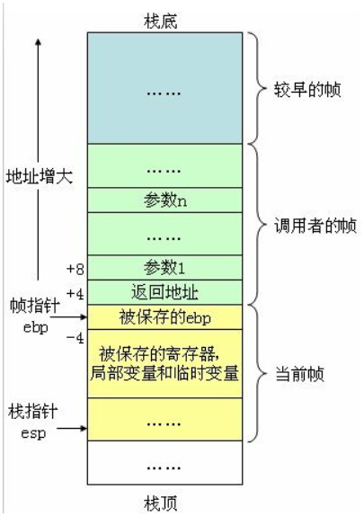

- ### 常见函数的识别

  - __security_cookie： GS检查，用于检查代码产生的缓冲区溢出

    - ```assembly
      # 初始化安全cookie的地方，通常位于程序开始
      mov         eax,dword ptr [__security_cookie (0C3A004h)]  
      xor         eax,ebp  
      mov         dword ptr [ebp-4],eax
      
      # 校验安全cookie，通常位于程序结尾
      mov         ecx,dword ptr [ebp-4]  
      xor         ecx,ebp  
      call        @__security_check_cookie@4 (0C311DBh)
      ```

  - CheckEsp：检查堆栈是否平衡，通常位于函数的结尾

    - ```assembly
      # 通常调用约定不正确，会检查失败
      cmp         ebp,esp  
      call        __RTC_CheckEsp (0C31212h)
      ```

  - CheckStackVars：用于检查数组是否越界，通常在数组操作后被调用

    - ```assembly
      mov         ecx,ebp  
      push        eax  
      lea         edx,ds:[0C3177Ch]  
      call        @_RTC_CheckStackVars@8 (0C31235h)  
      ```

- ### 程序特征的识别

  - #### 通过区段进行识别

    - 参考逆向 05 课上笔记

  - #### 通过连链接器版本识别

    |     VS     | 连接器版本 |
    | :--------: | :--------: |
    |   VC 4.2   |    XXX     |
    |   VC 5.0   |    5.0     |
    | VC 6.0(98) |    6.0     |
    |  VS 2003   | 7.0 / 7.1  |
    |  VS 2005   |    8.0     |
    |  VS 2008   |    9.0     |
    |  VS 2010   |    10.0    |
    |  VS 2012   |    11.0    |
    |  VS 2003   |    12.0    |
    |  VS 2015   |    14.0    |
    |  VS 2017   |   14.XX    |

  - #### 通过入口特征进行识别

    - VC 6.0 & 易语言

      - sub esp, 0x58;  call dword ptr [GetVersion];

      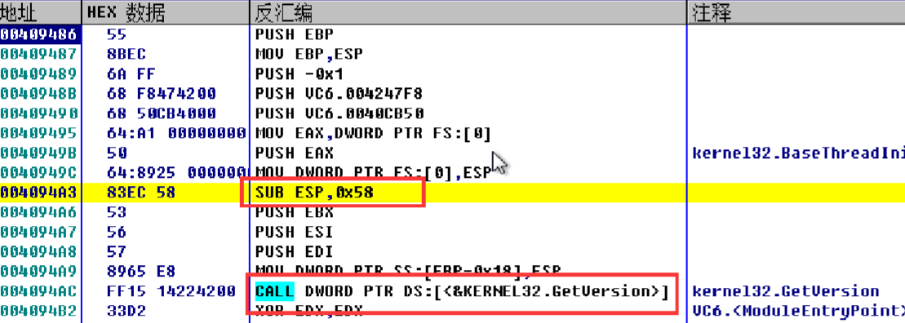

    - Delphi 程序

      - 连续的5个call，紧跟着一串0，第一个call内调用了 GetModuleHandle

      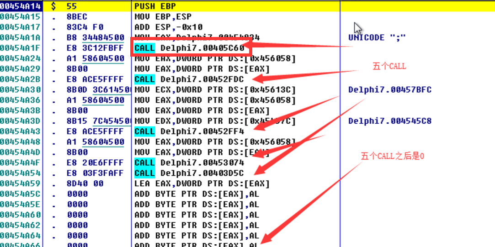

    - Borland C++ 程序

      - 第一条语句是JMP ，有明显的 "fb:C++HOOK" 字符串

      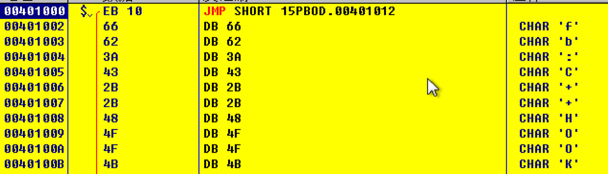

    - C\C++ 程序：

      - debug版本为连续的两个call，release版本为 call jmp

      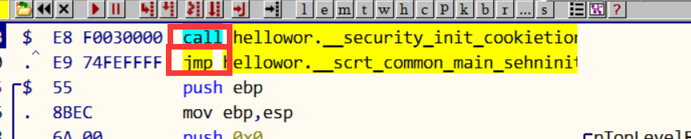

      - main 函数的调用过程

      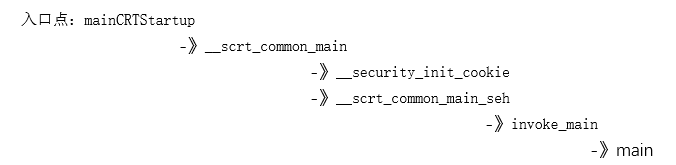

- ### 数据结构逆向

  - vector：内部实现为动态数组

    - ```cpp
      struct MyVector
      {
      	struct MyVector* pSelf;
      	int* pDataStart;
      	int* pDataEnd;
      	int* pBufEnd;
      };
      ```

  - list：内部实现为双向循环链表

    - ```cpp
      struct MyNode
      {
      	struct MyNode* pNext;
      	struct MyNode* pPrev;
      	int nData;
      };
      
      struct MyList
      {
      	struct MyList* pSelf;
      	struct MyNode* pRoot;
      	int nNodeCount;
      };
      ```

  - map: 内部的实现是红黑树(平衡二叉树)

    - ```cpp
      struct MyMapNode
      {
      	struct MyMapNode* pLeft;
      	struct MyMapNode* pParent;
      	struct MyMapNode* pRight;
      	int unknown;
      	int nkey;
      	int nValue;
      };
      struct MyMap
      {
      	struct MyMap* pSelf;
      	struct MyMapNode* pRoot;
      	int nNodeCount;
      };
      ```

- #### 常见的逆向分析方法

  - 字符串搜索
  - API 断点
  - 特征码查找（MFC）
  - 动静结合
  - 源码对比（Demo）
  - …………

## 2. 工具的使用

- #### 查壳工具

  - 用于查看和确定目标的程序版本以及是否被加壳，**原理是特征码识别**
  - PEID、ExeInfo、**D**etect**i**t**E**asy

- #### PE查看工具

  - 可用于解析目标程序的PE结构，包括PE头和区段、数据目录表等
  - LordPE、PEID、ExeInfo、DetectitEasy、**010Editor**

- #### 动态调试工具

  - x64Dbg、OllyDbg、windbg、immunity debugger(方便调试漏洞)、IDA
  - 使用 OllyDbg
    - 支持的调试方式
      - DLL调试，多线程调试，附加调试，拖拽调试，菜单打开等
    - 支持的断点
      - 软件断点，硬件断点，条件断点，消息断点，记录断点，内存断点
    - 设置消息断点的步骤：
      - 怎样找到窗口回调？
        - RegisterClass(Ex)、CreateDialog、DialogBoxParam
      - 分析模块->右键假定参数->WinProc->断点->在WinProc上设置消息断点
    - 常用的快捷键，参考课上笔记逆向03

- #### 静态调试工具

  - IDA 6.8 / **7.0**: 支持不同平台不同架构程序的调试
  - IDA的反汇编引擎采用 **递归下降** 的解析方式。
  - IDA的常用快捷键：
    - Shift+F5 ：打开签名窗口
    - ctrl + x 交叉引用（数据、函数）
    - ctrl + f: 人一窗口搜索数据
    - ESC：返回上一层
    - Shift+F12: 字符串窗口
    - a 转ASCII 字符串
    - h 十六进制十进制的转换
    - y 更改参数或函数的类型
    - n 修改数据或函数的名字
    - c: 将数据转成代码
    - p: 将代码转成函数

# 二、PE文件结构

## 0. 基本概念

- #### PE文件

  - 是一种文件格式，目前所学的 exe，dll，sys等都是PE文件
  - 通过检查DOS头的**"MZ"(0x5A4D)**和NT头的**"PE"(0x00004550)**来判断一个文件是不是有效的PE文件

- #### 术语解释

  - RVA: 数据在**虚拟内存**中的**偏移地址**
  - VA: 数据在**虚拟内存**中的**绝对地址**
    - **VA = 实际加载基址 + RVA**
  - FOA: 数据在**文件中**的**偏移地址**
    - **FOA = 需要转换的RVA - 所在的区段RVA + 所在区段的FOA** 

## 1. PE 头信息

- #### IMAGE_DOS_HEADER

  - e_magic: "MZ" - 0x5A4D
  - e_lfanew：指向NT头的**偏移**

- #### IMAGE_NT_HEADERS

  - ##### signature: "PE" - 0x00004550

  - ##### IMAGE_FILE_HEADER

    - NumberOfSections：区段的数量
    - SizeOfOptionalHeader： 扩展头的大小
    - Characteristics：可以判断当前**是不是DLL**，**是不是32位**，**重定位已分离(表示不需要重定位)**

  - ##### IMAGE_OPTIONAL_HEADER32

    - Magic：CPU架构：x32（0x10B）x64（0x20B）
    - AddressOfEntryPoint：程序的入口点(**OEP**) **RVA**
    - ImageBase：镜像的**默认加载基址**
    - SectionAlignment ：**内存对齐粒度**，通常是**0x1000**，要求大于文件粒度
    - FileAlignment：**文件对齐粒度**，通常是**0x200**,     **拉伸**
    - SizeOfImage：镜像大小，即**内存中的大小**， **最后一个区段的RVA + 最后一个区段的大小**
    - SizeOfHeaders：整个PE头部大小，通常是 0x400
    - DllCharacteristics ：特征标识0x40 有**随机基址**
    - NumberOfRvaAndSizes：数据目录表个数 0x10
    - DataDirectory：数据目录表

  - ####  IMAGE_SECTION_HEADER（重要）

    - Name[8]：区段名
    - virtualSize：内存中大小
    -  VirtualAddress：内存位置RVA
    - SizeOfRawData：文件中大小
    -  PointerToRawData：文件位置FOA
    - Characteristics：**区段属性(可读可写可执行)**，是否有代码

## 2. 导入表

```cpp
typedef struct _IMAGE_IMPORT_DESCRIPTOR {
    union {
        DWORD   Characteristics;
        DWORD   OriginalFirstThunk;	// INT
    } DUMMYUNIONNAME;
    DWORD   TimeDateStamp;
    DWORD   ForwarderChain; 
    DWORD   Name;					// 模块名称
    DWORD   FirstThunk;				// IAT 
} IMAGE_IMPORT_DESCRIPTOR;
```

- 导入表中保存的是一组 **以全0为结尾** 的 **MAGE_IMPORT_DESCRIPTOR** 结构。

  - INT：导入名称表，指向了一组**以0结尾**的 **IMAGE_THUNK_DATA** 结构，可以找到函数的ID或名称，但是有些时候其中会被填充为0，在文件和内存中它们保存的值是相同的。
    - 当 IMAGE_THUNK_DATA 字段的最高位为1，表示这是一个序号导入的函数
      - 序号的值为 0x0000???? & 0x0000FFFF = 0x0000???? 
    - 最高位为0，表示这是一个名称导入的函数，
      - 名称和序号保存在 0x???????? 的位置 IMAGE_IMPORT_BY_NAME

- IAT：导入地址表，在文件中存放的是INT的数据，当程序被加载到内存时，会被填充为函数的真是地址。

  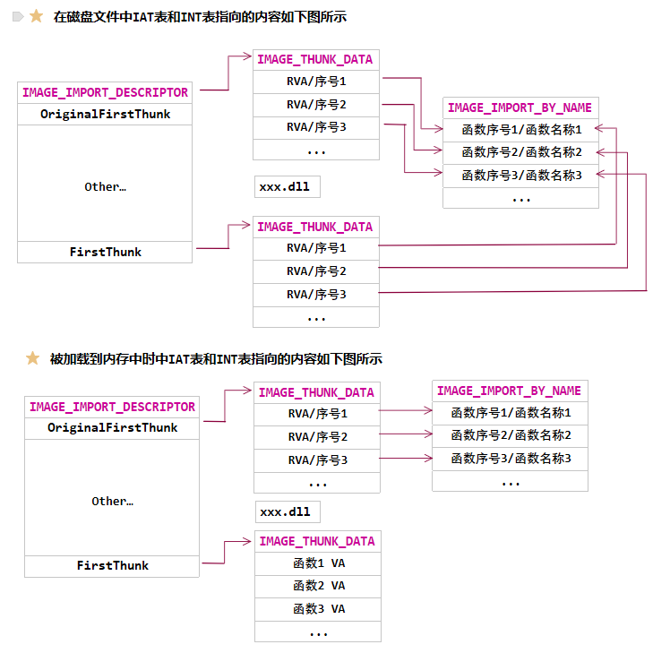

## 3. 导出表

```cpp
typedef struct _IMAGE_EXPORT_DIRECTORY {
    // 省略了无意义的字段
    DWORD   Name;					// 模块名RVA
    DWORD   Base;					// 序号的起始数值
    DWORD   NumberOfFunctions;		// 函数的数量
    DWORD   NumberOfNames;			// 有名字的函数的数量
    DWORD   AddressOfFunctions;     // 导出地址表的的RVA 【DWORD】
    DWORD   AddressOfNames;         // 导出名称表的RVA【DWORD-RVA】
    DWORD   AddressOfNameOrdinals;  // 导出序号表的RVA【WORD】
} IMAGE_EXPORT_DIRECTORY, *PIMAGE_EXPORT_DIRECTORY;
```

- 导出表只能有一个
- 名称表的数量和序号表的数量相同
- 导出函数的序号 = 基址(Base) + 索引(函数地址表下标)

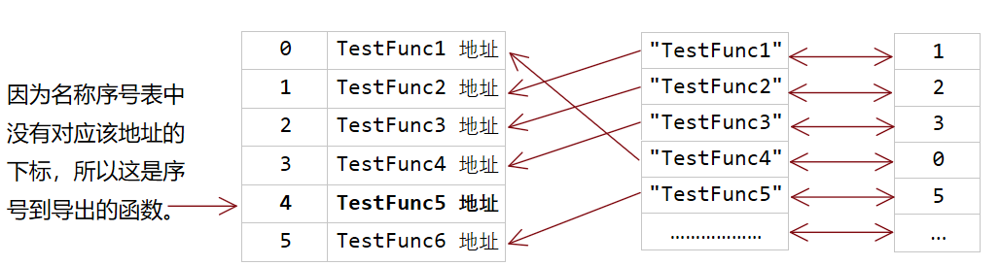

## 4. 重定位表

```cpp
typedef struct _IMAGE_BASE_RELOCATION {
    DWORD   VirtualAddress;
    DWORD   SizeOfBlock;
//  WORD    TypeOffset[1];
} IMAGE_BASE_RELOCATION;
```

- 重定位表由多组重定位块组成，每个重定位块保存的是一个分页(RVA)中需要重定位的所有数据。
- 重定位项的个数 = (SizeOfBlock– sizeof(IMAGE_BASE_RELOCATION)) / 2
- 每一个重定位项都是一个**WORD**类型的值，标识了当前数据的**类型**以及**偏移（相对VirtualAddress）**
- 需要重定位的数据**所在的位置** = 实际加载基址 + VirtualAddress + 重定位数据的偏移，其中保存的是一个偏移
- 重定位公式：**需要重定位的地址 - 默认加载基址 + 实际加载基址**

## 5. 资源表

- #### 三层结构

  -  一层：资源种类；二层：此种资源的个数，名称； 三层：资源数据
  -  每一层都是 **IMAGE_RESOURCE_DIRECTORY** 开始，后面跟着**一组 **  **IMAGE_RESOURCE_DIRECTORY_ENTRY**结构体，保存的是资源的类型和名称
    - 结构体个数 = NumberOfNamedEntries  + NumberOfIdentries​       

- #### 第一层：第二层：

  - 资源的类型名称，当 NameIsString 为1时，标识这是一个自定义的名称，使用 NameOffset字段可以找到 **IMAGE_RESOURCE_DIR_STRING_U** 字段，其中保存了字符串名称。

- #### 第三层：

  - 指向 IMAGE_RESOURCE_DATA_ENTRY，保存了**数据的偏移**和**大小**

## 6. 其他表

- #### TLS表 IMAGE_TLS_DIRECTORY

  - 使用 __declspec(thread) int nNum = 99; 定义TLS变量

  - TLS 函数的原型如下，和DllMain相比，它们只有返回值类型不同

    ```cpp
    Void NTAPI t_TlsCallBackA(PVOID DllHandle,DWORD Reason,PVOID Red);
    ```

  - TLS 函数的调用顺序**位于main函数前**，通常用于进行反调试

# 三、加壳与脱壳

## 1. 脱壳技巧

- 脱壳的基本步骤
  - 找OEP -> [还原IAT] -> dump文件 -> 修复IAT
  - 具体的步骤见课上笔记

## 2. 加壳原理

- #### 什么是加壳

  - 利用特殊的算法，对可执行文件里的资源数据或代码进行压缩加密。添加对应的Stub代码段用于对加密后的文件解密，以及充当PE加载器的角色，对目标程序执行修复重定位**、修复(加密)IAT**等操作。
  - 常见的手段有：伪装OEP特征，反反汇编，IAT加密，函数偷取(通常偷取OEP)，代码虚拟化等

- #### 手动添加区段的步骤

  1. 区段头表中添加区段信息
  2. 文件头表中添加区段个数
  3. 修改扩展头中镜像大小
  4. 修改OEP为新的区段RVA
  5. 填充文件，主要是跳转原OEP的代码

# 四、病毒分析

## 1. 病毒分类

- 感染性病毒、蠕虫病毒、勒索病毒、APT 木马、RootKit、后门、间谍软件

## 2. 常见传播方式

- 移动介质传播、网络传播、**捆绑邮件**、即时通信软件、局域网共享文件夹、网络下载、*漏洞* 。

## 3. 常见行为

- 操作注册表设置开机启动
- 设置计划任务，定时关机
- 遍历进程，关闭杀软
- 遍历文件，进行感染
- 下载软件，捆绑安装
- 连接网络，传播病毒
- 释放文件，拷贝自身

## 4. 分析方式

- 静态分析：使用IDA进行静态分析
- 动态分析：使用OD等调试器
- 行为分析：使用火绒剑，Process Monitor，Api Monitor等进行行为监控
- 在线沙箱：使用微步云杀箱等获取病毒行为报告

# 五、漏洞利用

## 1. 名词解释

- fuzz：是 Fuzz testing 的缩写，全称模糊测试，是一种通过无规则试探探测漏洞的的方式。

- exploit：通常指用于验证漏洞的一段代码

- shellcode：是一段利用特定漏洞的代码

- payload：在漏洞领域，指的是实际用于攻击的那一段代码

- GetPC：获取当前指令所在地址的一种方式

  - 缺点是会产生大量的 0，可能被截断(“\n”, "\r"," ", "\0")

    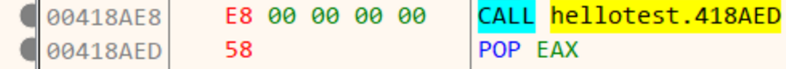

  - 使用浮点指令 FSTENV，缺点是会损坏栈的0xc大小的数据 

    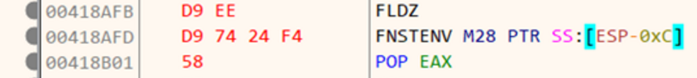

  - 缺点是会产生一条冗余的指令，inc ebx

    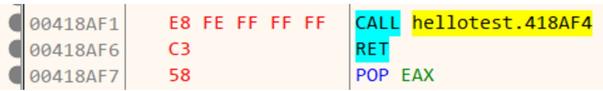

## 2. 获取kernel32的基址

```assembly
mov eax, fs:[0x30];			 // 获取 PEB
mov eax, [eax + 0x0C];		 //	获取 PEB_LDR_DATA
mov eax, [eax + 0x1c];		 // LIST_ENTRY.Flink -> 第一个模块   ntdll
mov eax, [eax];				 // kernelbase.dll -> 第二个模块
mov edx, [eax + 0x08];		 // _LDR_DATA_TABLE_ENTRY.DllBase;
mov kernel32, edx;           // kernel32.base
```

- 推荐文章：http://www.cnblogs.com/bokernb/p/6404795.html

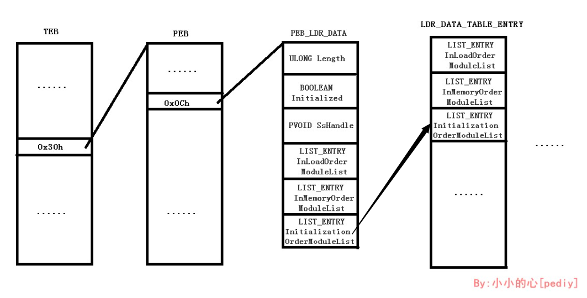

# 六、内核编程

## 1. 保护模式

- #### 分段基址

  - 保护模式下段寄存器变成段选择子(高速缓冲区)，由 **13位索引 1位TI 2位RPL** 构成
    - RPL 表示当前访问段的请求权限
      - MAX（CPL，RPL）<= DPL
    - TI描述了当前使用GDT还是LDT，通常为0
      - rgdt是一个48位寄存器，gdtr 是基址  gdtl是范围
    - 索引即位于GDT或LDT中的下标

  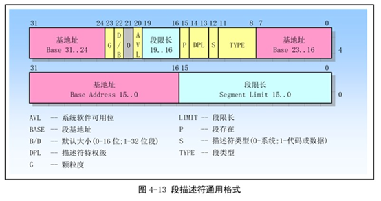

- #### 分页机制

  - 没有开启PAE[10-10-12]：CR3(页目录表地址) -> 页目录项 -> 页表项 -> 物理地址

    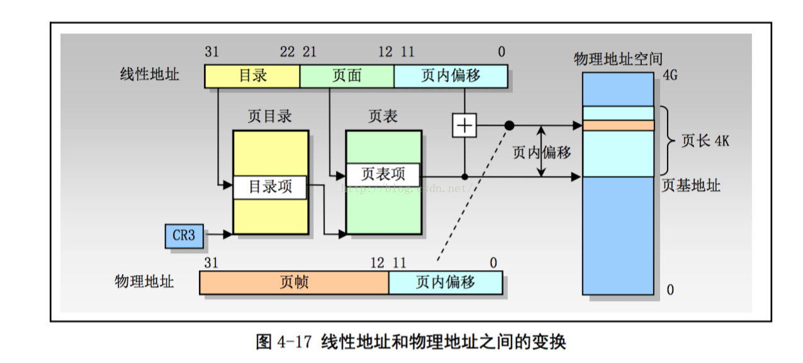

  - 开启了PAE[2-9-9-12]：CR3(页目录表指针) -> 页目录表地址->页目录表 -> 页表项 -> 物理页地址

  - **保护模式具体内容参考群文件内的保护模式笔记**

## 2. 内核编程

- ### 相关术语

  - DriverEntry：驱动程序的入口函数，参数一是驱动对象，参数二是所在路径
    - 注意 DriverEntry 没有名称粉碎，C++编写需要加上 extern "C"
  - 驱动对象：DRIVER_OBJECT，类似于三环中应用程序的身份，不能进行直接通信
    - 使用其中的 **DriverSection** 可以遍历系统中的所有驱动对象
  - 设备对象：DEVICE_OBJECT，类似于三环中的窗口，是程序的一部分，可用作接收消息
    - 需要为设备指定符号链接名供三环访问，格式：`\DosDevices\Name`
  - IRP：I/O请求数据包，类似于窗口程序中的消息
  - IRQL：中断请求级别，从低到高为 **PASSIVE_LEVEL** 、**APC_LEVEL** 、**DISPATCH_LEVEL**
    - 如果到来的中断有更高优先级，那么当前中断被挂起，CPU处理高优先级的中断
  - SSDT：系统服务描述表，保存了一系列的内核层函数
    - 通常使用 SYSENTER 进入内核，调用号保存在 eax寄存器，除此之外msr寄存器中的0x174号负责保存CS段寄存器，0x175号负责保存SS段寄存器，0x176号负责保存eip，通常是 KiFastCall，eax保存的是调用号 
  - 分页内存：保存在页交换文件中的数据，使用会产生缺页异常
  - 非分页内存：直接保存在物理内存中的数据

- ### R0/R3通信的通信方式

    - 直接方式(DO_DIRECT_IO)：通过irp->MdlAddress获取

    - 缓冲区方式(DO_BUFFERD_IO)：通过irp->AssociatedIrp.SystemBuffer获取

    - 其他方式(NULL)： 通过irp->UserBuffer获取

- ### DeviceIoControl

    - 使用 **CTL_CODE** 定义需要发送的控制码。
    - 四种数据的传输方式
      - METHOD_BUFFERED：缓冲区
      - METHOD_IN_DIRECT \ METHOD_OUT_DIRECT：直接方式
      - METHOD_NEITHER：两者都不的方式

- ### 内核Hook

    - SSDT Hook -> 替换函数
    - SYSENTER Hook -> KiFastCallEntry
    - Object Hook -> OBJECT_TYPE -> _OBJECT_TYPE_INITIALIZER（保存了用于操作对象的函数）

- ### 内核重载

    - 开辟一块新内存空间，模拟PE加载器将内核模块重新加载到这段内存，用于修复被Hook的SSDT表


# 七、LINUX与移动安全

## 1. linux 指令 (基本指令)

## 2. smali 指令 

## 3. 工具的使用