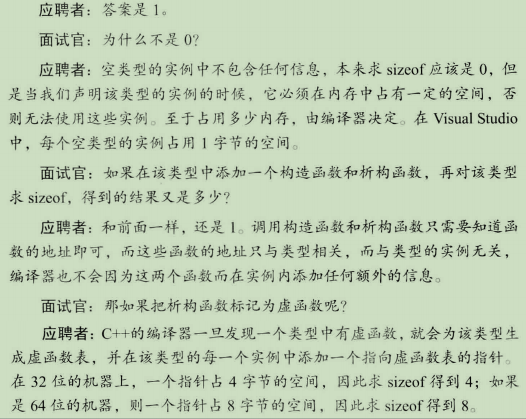
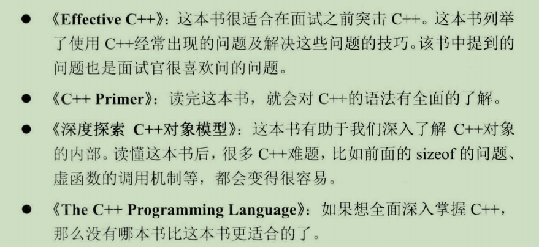

[toc]


## 一、要点记录

1、面试要准备好合适的问题问面试官

2、面试自我介绍主要介绍学习、和工作经历 30秒-60秒

3、介绍项目经验和简历书写参考 page 6


## 二、面试问题

### 1、为什么要跳槽？

因为我现在职位虽然是安全开发工程师，但主要的工作内容也包含了系统运维、开源软件功能测试，产品研发只占了我工作量的三分之一，工作的内容比较杂乱。虽然这个过程中我也学到了很多知识，但是我的开发能力并没有得到有效的提高。同时，我现在的工作很少接触c/c++，而我对c++方面开发很感兴趣，我看到你们公司的该职位非常适合我，因此准备出来寻找机会

（测试过的软件，suricata, dpdk-sruicata, tcppc_go, trudy,MHN蜜罐，HFish）


### 2、const放在不同位置的不同含义

一、类型说明符前 说明指定类型是常量，变量却可以更改，比如 常量指针

二、类型说明符后 说明指定的变量是常量，比如 指针常量


### 3、c++值传递、指针传递、引用传递的区别

* 值传递：对变量进行一次拷贝
* 指针专递：拷贝一个指针副本，指向原来数据的那个地址
* 引用传递：直接使用原数据，没有拷贝指针


### 4、面试问面试官的问题

最好是与该职位相关，有什么正在开发项目等，在网上收集该公司信息后好好考虑问什么

* 你们团队的嵌入式研发是ARM-Linux方面的还是单片机方面的？
* 你们嵌入式研发团队的业务量是不是很多啊？


### 5、你期望的薪资

关于这个问题，我想问你们的这个岗位的薪资区间是多少？还有薪资体系结构是什么样的？


### 6、你的优点和缺点

```
优点：
1、敢于挑战新知识和新技术，勇于跨出舒适区，毕竟IT行业发展迅速，我们程序员需要紧跟时代步伐
2、工作从不拖泥带水，在第一时间完成任务就立即上报。而不会有反正上交任务的时间还没到，就开始拖拖拉拉磨洋工的做法。
3、工作中遇见了问题，我有立马记录笔记的习惯，这样能帮助我更好的完成工作任务和记忆工作内容，我坚信好记性不如烂笔头。
```

```
缺点：
1、我的工作经验和阅历较浅，某些技术和知识还未掌握，不过我会在业余时间加强学习，早日弥补
2、我不太善于和陌生人做过多的交际，尤其和同一个公司其他部门的同事打成一片，这有一定的难度
```


## 三、常问技术问题

### 1、定义一个空的类型，里面没有任何成员变量和成员函数，对该类型求sizeof，得到的结果是多少？




### 2、C++ 推荐书籍




### 3、常量指针和指针常量的的区别

```
常量指针 int const *p =NULL （*p）值不可变，p这个指针地址可变
指针常量 int *const p =NULL p指针地址不可变，*p 这个值可变
```


### 4、深拷贝和浅拷贝的原理

```
浅拷贝只是对指针的拷贝，拷贝后两个指针指向同一个内存空间； 深拷贝开辟了一块内存空间对内容进行拷贝，深拷贝后的指针是指向两个不同地址的指针。
```


### 5、C++是按照在初始化列表的顺序初始化成员变量的吗？

```
在C++中，成员变量的初始化顺序只与他们类中的声明顺序有关，而与初始化列表顺序无关
```

